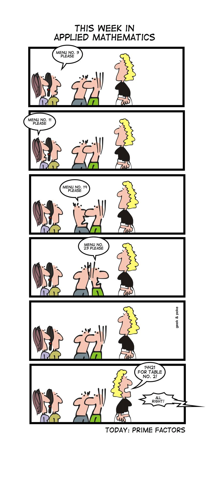

.. This document is Licensed Creative Commons:

Attribution, Share Alike

Its Only a Little Math
======================

I know that introductory programming sends a lot of people running because of
the math.  But, stay with me for a just a little bit because this is fun.
No really it is.

   Creative Commons Attribution to geekandpoke.typepad.com

This cartoon inspired me to learn a bit more about prime factorization.  If
you don't get the punch line of the cartoon, let me explain it to you.  The number that the
waitress calls into the kitchen is 14,421.  The diners have ordered numbers
3, 11, 19, and 23 off the menu.  So you might notice that all of those
numbers are prime.  But the most important thing is that
``3 * 11 * 19 * 23 == 14421`` .  If you add to this the fact that **every number
has a unique set of prime factors** then the kitchen knows exactly what was ordered, because no other product of prime numbers would give 14421.

In case its been a while since you had math class, here is a quick definition of a
prime number.  A Prime number can be divided evenly only by 1 or itself. And,
it must be a whole number greater than 1.  The first few prime numbers are:
2, 3, 5, 7, 11, 13, 17.  As a warmup exercise, Write a function called
is_prime.  This function should take an integer as a parameter and return
True if the number is prime and False if the number is not prime.

.. actex:: is_prime

   from test import testEqual

   def is_prime(n):
       # your code here

   testEqual(is_prime(3), True)
   testEqual(is_prime(4), False)
   testEqual(is_prime(9), False)
   testEqual(is_prime(877), True)

The real topic of this post is to look at an algorithm for how to compute the prime factors of a number.  Lets work a couple of examples to get the idea.  What are the prime factors of the number 20?  The best way to do this is to start out from the smallest prime number and work our way up.  Is 20 divisible by 2?  Yes, 2 times 10 is 20 so we have our first prime factor of 2.  But, 10 is not a prime number so we are not done, once again we will start with 2 and we know that 2 * 5 is 10 so we have another prime factor of 2.  Now we know that 5 is a prime number as well so we are done:  20 = 2 * 2 * 5.  Of course if we didn't know that 5 was prime we would try to divide it by 2, 3, and 4 to decide.

What are the prime factors of 105?  Since 105 is not divisible by 2 we will try 3, and 3 * 35 is 105 so our first prime factor is 3.  Now 35 is not divisible by 2 or 3 or 4, but 5 * 7 is 35 so 5 is our next factor, and of course 7 is prime so we have our list of prime factors as 3, 5, 7.

.. fillintheblank:: primefact_1
   :correct: 2, 5, 7, 11

   The prime factors of 770 are ___ .  Show your answer as x, y, z

Ok, now lets turn what we've learned by working these examples into a Python function.  For our first attempt we will use two functions.  The first function called ``get_prime_factors`` will keep track of the list of factors as well as the current number, N, we need to divide.  The second function ``get_next_prime_factor`` will try to find the next prime number that divides N.  Lets do the ``get next prime factor`` first.

.. activecode:: gnp_1

   import math

   def get_next_prime_factor(n):
       if n % 2 == 0:
           return 2

       for x in range(3,n//2,2):
           if n % x == 0:
               return x

       return n

   print(get_next_prime_factor(4))
   print(get_next_prime_factor(9))
   print(get_next_prime_factor(7))

The first if statement checks to see if the number is divisible by 2.  If so then we just return 2.  the for loop checks all of the odd numbers up to ``n//2``.  Now, there might be a couple of things that puzzle you about that.  Firstly, is ``n//2`` the best limit?  No, see if you can figure out a smaller limit.  Secondly, you might be thinking that we might get a wrong answer.  Think about the sequence of numbers that range creates:  3, 5, 7, 9, 11, 13, 15, ...  Oh no!  there are non-prime numbers in that list, what if we return one of the non-primes?  This won't happen and here's why.  Think about 9  if any number is divisible by 9 it will also be divisible by 3, but we will check 3 first.  similarly if any number is divisible by 15 it is also divisible by 3 and 5.  In general any larger non-prime in the range will be divisible by a prime number that comes before it in the range.  Does that mean we will do some extra work?  Yep!  But, its only one division, and eliminating the non-primes from the range would likely be more work than just living with the extra division.

.. admonition::  Compatibility Note

    If you are using Python 2.x you will want to use xrange rather than range, or you will get an out of memory error.  I'll explain why this is the case in the advanced topics section.

Now, lets write the ``get_prime_factors`` function.

.. activecode:: gpf_2
   :include: gnp_1

   def get_prime_factors(n):
       factors = []

       while n > 1:
           factor = get_next_prime_factor(n)
           factors.append(factor)
           n = n // factor

       return factors

   print get_prime_factors(14421)

So, lets think about our implementation a bit.  The worst case scenario for our program is that we try to factor a big prime number.  In that case we will have to check every other number from 3 to the large prime.  Essentially that means you would have to check (large_prime /2) possible factors.  On my 2.8 Ghz Core i7 iMac the number 1,073,676,287 took 27 seconds to factor into itself and 1.  The number 68,718,952,447 took 1,756 seconds.  We can see that the time it takes to factor these numbers is approximately linear, that is the second number is 64 times larger than the first and it took 65 times as long to factor.

Now, the reason this is important is that factoring really large prime numbers like  359334085968622831041960188598043661065388726959079837 will take a very very long time.  In fact since the number above is :math:`5.2 \times 10^{42}` times larger than our second number above we would predict that it would take :math:`9.3 \times 10^{45}` seconds to factor the second number.  For those of you keeping track the universe is only :math:`4.7 \times 10^{17}` seconds old!

`Public Key cryptography <http://en.wikipedia.org/wiki/Public_key_cryptography>`_ relies on factorization being very very hard, and as we have just shown it is.  But here is where that is actually a good thing.  To oversimplify just a bit, in public key cryptography you have two keys a public key and a private key.  The public key is a really really big number that is the product of two really big prime numbers.  The two factors make up the private key.  So, if an attacker wanted to steal a persons private key they would need to find the two prime factors for the public key.  If the really big number in the preceding paragraph is one of my prime numbers I think I'm feeling pretty safe.  Of course there are other algorithms that are better than this one, for factoring prime numbers, but they are still poor enough that public key cryptography is safe.

A Recursive Solution
--------------------

Here is another very elegant implementation of ``get_prime_factors``  This one is a recursive implementation.

.. activecode:: primefactor_recurse

    import math

    def get_prime_factors(num,fact):
        if fact > math.sqrt(num):
            return []
        if num % fact == 0:
            return [fact] + get_prime_factors(num // fact, 2)
        return get_prime_factors(num, fact+1)

    print get_prime_factors(14421,2)

The base case in this function is ``fact > num``.  If num the factor is greater than the number then there is no way it is a factor of num and we can move on.  If, however, num is evenly divisble by fact we add that to the list and recursively look for the factors of ``num // fact`` starting with 2 again.  Although this algorithm is quite elegant in its expression it suffers from a big problem.  When you try to factor a number like 1073676287 the program fails because Python has to recurse too deeply.

Two Advanced topics
-------------------

In a note up above I mentioned that in Python 2.x you would want to use xrange in place of range for a large number.  Why is this?  And why does it only matter for Python 2.x?  In Python 2, range actually constructs and returns a list of integers.  So for a large number the list is huge and consumes a lot of memory, enough that it will cause the program to fail with an out of memory error.  However ``xrange`` and ``range`` in Python 3 return a very different object.  They are called **generator** functions, and these functions return **iterator** objects.

The idea is that an iterator object is an object that returns the next value on demand but it does not pre-compute all of the values it computes the value when you ask for it.  The big win is that a generator object uses **a lot** less memory.  Now you can see how this would work nicely in a for loop when the loop just needs to get the next value in the sequence to assign to the loop variable.

The main thing to know about iterators is that they have a method called ``next()`` which returns the next object in the sequence.  For a for loop you can see where that would be very useful.  They also support a method called ``__iter__()`` but for a true iterator this method does nothing except return itself.  The ``__iter__()`` method allows container objects like lists and dictionaries to return an iterator object that provides a ``next`` method.  A list object does not have a ``next()`` method -- try it -- but if you call ``__iter__()`` on a list will return a ``listiterator`` object that does have the ``next`` method.

Lets look at a simple example of a generator, in fact it will show how xrange is implemented.

.. codelens:: generator_1
    :showoutput:

    def myrange(n):
        i = 0
        while i < n:
            yield i
            i += 1

    x = myrange(10)
    print x.next()
    print x.next()

Calling ``myrange(10)`` returns an iterator object.  When next is called the code inside ``myrange`` runs until the ``yield`` statement which acts like a return statement, except that all the state of the function is preserved and the function suspends its activities until next is called again.  You can see this illustrated nicely in codelens.

You can also see how this works in a for loop with this example.

.. codelens:: generator_2
    :showoutput:

    def myrange(n):
        i = 0
        while i < n:
            yield i
            i += 1

    for i in myrange(5):
        print i

You can also implement a generator as a simple class that supports the ``__iter__`` and ``next`` methods.  If you want to see an example, and read more about generators you can go the the `Python Wiki Page <http://wiki.python.org/moin/Generators>`_.

Finally, lets look at a really elegant solution for generating prime numbers.  Of course, we will use a generator function to accomplish this.

::

    def primegen(n):
        yield 2

        primes = []
        primeCandidate = 3
        while primeCandidate < n:
            if all(primeCandidate % p for p in primes):
                primes.append(primeCandidate)
                yield primeCandidate
            primeCandidate += 2

    primelist = primegen(10)
    print list(primelist)

There are a number of really cool things about this primegen function.  First, it has two yield statements!  Second is the use of the ``all`` function.  The all function takes any iterable as a parameter and returns True if all the elements of the iterable turn out to evaluate to a non-false value.  Recall that in python all non zero numbers are True as are all objects except the empty string and the empty list.  So, ``all([1,2,3])`` returns True, as does ``all('hello')`` but ``all([1,0,1])`` returns False because of the 0.

Lets unpack the ``all`` statement a bit into two lines that are **almost** equivalent to the one line above::

    mylist = [primeCandidate % p for p in primes]
    all(mylist)

Now, mylist is going to contain a bunch of numbers.  If all the numbers are non zero then none of the previous primes in the list ``primes`` divide evenly into ``primeCandidate`` and we know that ``primeCandidate`` itself is a prime number!  If, however, one of the numbers in mylist is 0 then we know it is divisible by another number besides 1 and itself and primeCandidate is not a prime number.

 Now, you will notice that I emphasized the word **almost** just a few lines back.  The reason for this is that ``mylist`` is really a list created by a list comprehension.  By embedding a list comprehension like statement as the parameter to a function, we actually are creating a generator to pass to the function!  Here's proof::

     >>> def myfunc(arg):
     ...    print type(arg)
     ...
     >>> myfunc(x for x in range(10))
     <type 'generator'>
     >>>

Now, skulpt does not behave this way, so here is an unpacked version of primegen for you to try out.

.. activecode::  primegen_gen

    def primegen(n):
        yield 2

        primes = []
        primeCandidate = 3
        while primeCandidate < n:
            plist = [primeCandidate % p for p in primes]
            if all(plist):
                primes.append(primeCandidate)
                yield primeCandidate
            primeCandidate += 2

    primelist = primegen(100)
    print list(primelist)

If you have read this far, I hope you have enjoyed this excursion into generators, and I really hope that  you can see how useful they are when you want to save on memory.

.. index:: prime, factor, generator, iterator, geekandpoke, yield