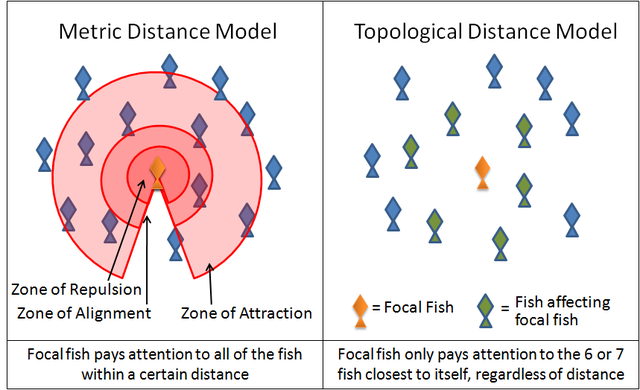

.. This document is Licensed Creative Commons:
   Attribution, Share Alike by Brad Miller, Luther College 2013

Kill Decision meets Finding Nemo
================================

This week's post is inspired by the book *Kill Decision* by Daniel Suarez.
Suarez is a relatively new Techno-Thriller author, and I love his books. In
this book, unmanned drones already exist and are causing some major problems.
How do these drones know what to do if they are not controlled remotely? How do
they fight? Thats the scary part. It turns out they get their fighting
instincts from some of the fiercest killers on the planet... Weaver ants. The
female protagonist studies the social structure of ants, (she's a
myrmecologist) however unknown forces have taken the algorithm she has
developed to implant in unmanned drones.

This video shows you everything you need to understand about how ants are attracted to pheromones and will sense the pheromones and move toward them.  In the video the blue blobs are patches of food, and the purple blog is the nest.  When ants find food they head back to the nest, but they also leave behind a trail of pheromones that other ants can follow.  the stronger the scent the whiter the trail.  Yuu can see how quickly the majority of the ants get to the strongest trail.  In the case of drones in the book getting food equals killing people and tearing apart things.

.. raw:: html

   <iframe width="420" height="315" src="http://www.youtube.com/embed/9liT8epLnAQ" frameborder="0" allowfullscreen></iframe>

The rest of the story you'll have to read for yourself [1]_.  If you want to
readd more about intelligence that arises from simple organisms and behavior
check out *Turtles, Termites, and Traffic Jams* by Mitchel Resnick.

The ant intelligence in *Kill Decision* got me to thinking about swarming bees
and schooling fish and flocking birds. Have you ever wondered how such creaters
with supposedly no intelligence form themselves into groups that seemingly
exhibit intelligent behavior? It turns out that there has been a lot of
computer science work on this over the years, so I looked at some schooling
algorithms and I wondered whether or not I could implemented something really
simple in Python. I've always been interested to investigate how Pixar made the
giant stampede of wildebeest in Lion King, or how the sardines in Nemo were
modelled. Although there are many `swarming algorithms
<http://en.wikipedia.org/wiki/Swarm_intelligence>`_ that are used to solve
really hard problems I'm going to go with something simple and graphical.

First Example
-------------

Here's a simple example Suppose you have a bird or a fish and the only rule they have for where to go next is to head directly for the fish or bird that is "most directly in their line of vision."

The procedure for this is pretty easy.  First, iterate through all the other organisms in our simulated world.  As we iterate we will:

1. Eliminate all of those that are behind us.  Lets assume that our organisms can only see things in front of them.
2. Of all the things in front of us choose the one that is most closely aligned with our own heading.
3. Change our heading to go directly toward that organism.

Here is a first try at implementing, and graphically showing the algorithm
I've just described.  **Warning** this is ugly code.  This example took me 20
minutes to hack together, with little forethought or planning.  But as you
can see it works.  As it turns out its really nothing like a swarm or a
school of fish but more of a giant follow the leader game.  What is
interesting to me is that in just a short coding session implementing a
single rule you do get something that looks like there is a pattern to the
behavior.

.. activecode:: follow_the_leader

    import turtle
    import random
    from math import cos, radians

    swarmSize = 25
    t = turtle.Turtle()
    win = turtle.Screen()
    win.setworldcoordinates(-600,-600,600,600)
    t.speed(10)
    t.tracer(15)

    swarm = []

    def getNewHeading(i):
        minangle = 999
        for j in range(swarmSize):
            if i != j:
                head = swarm[i].towards(swarm[j]) - swarm[i].heading()
                infront = cos(radians(head))
                if infront > 0:
                    if head < minangle:
                        minangle = head
        return minangle

    for i in range(swarmSize):
        nt = turtle.Turtle()
        swarm.append(nt)
        nt.up()
        nt.setheading(random.randrange(360))
        nt.setpos(random.randrange(-300,300),random.randrange(-300,300))
        nt.down()

    for turn in range(100):
        newhead = []
        for i in range(swarmSize):
            minangle = getNewHeading(i)
            if minangle == 999:
                newhead.append(swarm[i].heading())
            else:
                newhead.append(minangle+swarm[i].heading())

        for i in range(swarmSize):
            swarm[i].setheading(newhead[i])
            swarm[i].forward(10)

    win.exitonclick()

Even though, as I said, the code above is ugly there are a couple of things I
would point out that are important. The expression ``cos(radians(head))``
determines whether the other object -- ``swarm[j]`` is in front of or behind
the object ``swarm[i]``. We define "in front of" to be based on the heading of
the object ``swarm[i]``.  This is important because we are assuming that you
can only see objects in front of you.

Now the list, ``newhead`` is important, because when we are doing a
simulation, that is simulating a bunch of things **simultaneously** you have
to do things in the simulation in two steps.

1.  Each object must make a decision about their new heading.
2.  Each object takes action on their decision.

Although in the real world all of these decisions and actions happen in
parallel in the non-parallel simulation we do them in two stages to simulate
the parallelism.  In code this plays out by having each object in the swarm
make a decision about what its new heading will be and recording that
decision in ``newhead``.  Once all of the decisions are made then we can go
back and implement the decisions and update our display of the world
``swarm[i].setheading(newhead[i])``  This is a good example of parallel array
construction.  Where the new heading for ``swarm[i]`` is in ``newhead[i]``.

With the initial implementation out of the way, lets look at a much nicer and
cleaner version that illustrates some nice Object Oriented Programming
techniques.  If you are not so familiar with writing classes in Python you may
want to take time to read `about classes <http://interactivepython.org/courselib/static/thinkcspy/Classes/classesintro.html>`_ and `inheritance <http://interactivepython.org/courselib/static/pythonds/Introduction/introduction.html#inheritance-logic-gates-and-circuits>`_.

An Object Oriented Implementation
---------------------------------

.. activecode:: second_try

    from turtle import Turtle, Screen
    import random
    from math import cos, radians

    class Schooler(Turtle):
        swarm = []

        def __init__(self):
            Turtle.__init__(self)
            self.up()
            self.setheading(random.randrange(360))
            self.setpos(random.randrange(-200,200),random.randrange(-200,200))
            self.down()
            self.newHead = None
            Schooler.swarm.append(self)

        def getNewHeading(self):
            minAngle = 999
            for other in Schooler.swarm:
                if self != other:
                    head = self.towards(other) - self.heading()
                    if cos(radians(head)) > 0:
                        if head < minAngle:
                            minAngle = head
            if minAngle == 999:
                self.newHead = self.heading()
            else:
                self.newHead = minAngle+self.heading()

        def setHeadingAndMove(self):
            self.setheading(self.newHead)
            self.newHead = None
            self.forward(10)

    def main():
        swarmSize = 25
        t = Turtle()
        win = Screen()
        win.setworldcoordinates(-600,-600,600,600)
        t.speed(10)
        t.tracer(15)
        t.hideturtle()

        for i in range(swarmSize):
            Schooler()

        for turn in range(50):
            for schooler in Schooler.swarm:
                schooler.getNewHeading()

            for schooler in Schooler.swarm:
                schooler.setHeadingAndMove()

        win.exitonclick()

    main()

Although this implementation does exactly the same thing as the first one you
will hopefully find this one easier to read and follow. There are a couple of
very important things about this code to notice. First, the class Schooler, is
a subclass of Turtle. That is, ``Schooler ISA Turtle``. This has some really
great side effects in that all of the Turtle methods for getting location and
heading are availalbe as ``self.`` methods.

We can also eliminate the parallel list construction used to hold the new
position for the Schooler.  The new position becomes an instance variable of
the class.  We still need to make the decision in one phase and take action
on the decision in the second phase, but that is OK and the two loops make it
very clear what is happening.  ``getNewHeading`` then ``setHeadingAndMove``.

Another important feature to notice is that the variable swarm is no longer a
global variable, but rather has become a 'class variable' of the class
Schooler.  This means that every instance of the Schooler class can access
the swarm as ``Schooler.swarm``.  In fact, individual instances can
also access swarm as ``self.swarm`` **but** if an method makes a change to
``self.swarm`` then the variable becomes an instance variable for that
instance which shadows the class variable.

A More Interesting Example
--------------------------

My initial example was pretty simplistic, as you can imagine there are lots
of other ways to model this swarming or schooling behavior. Many models
follow these three basic rules:

1.  Move in the same direction as your closest neighbors.
2.  Don't stray off by yourself - stay close
3.  But not too close.  Avoid collisions with your neighbors.

Simulations that demonstrate these rules have been around since the Boids_
program by was first created in 1986.  You can implement your own version of
this by creating a new subclass of ``Schooler`` called ``FocalFish``.  To get new behavior you will need to write a new ``getNewHeading`` method in the new class.   Note, you will not need to write or re-write the  ``setHeadingAndMove`` or ``__init__`` methods!

This diagram may give you some ideas on how to implement your ``getNewHeading`` method.

In the diagram you can see that you can classify all the other organisms (Fish) into one of three zones:  1) Zone of repulsion, 2) zone of alignment, and 3) zone of attraction.

1.  In the zone of repulsion the current fish will seek to move itself away from its neighbors.  You might think of doing this by finding the midpoint of all the neighbors, finding the heading to go towards that midpoint, and then doing going in the opposite direction.

2.   In the zone of alignment, the fish would want to align its heading with the average heading of all the fish in the zone.  You might average the headings of all the other fish in this zone to get your own heading.

3. In the zone of attraction you might calculate the midpoint of all the fish in the zone and then head toward that point.

Once you have these rules calculated it is fun to experiment a bit.  Should you try to apply all three rules all the time?  Or should you only apply the rule in the closest zone that has fish in it?  If you apply the rules for more than one zone how should you combine the headings for the different zones?

If you have an interesting solution, please post it to the comments, it should be interesting to experiment.  Next time we'll look at some solutions and think about what would happen if a certain fish in the school was a 'leader' and or how a school/swarm would respond to an obstacle.

.. actex:: focalfish_1

    from turtle import Turtle, Screen
    import random
    from math import cos, radians

    class Schooler(Turtle):
        swarm = []

        def __init__(self):
            Turtle.__init__(self)
            self.up()
            self.setheading(random.randrange(360))
            self.setpos(random.randrange(-200,200),random.randrange(-200,200))
            self.down()
            self.newHead = None
            Schooler.swarm.append(self)

        def getNewHeading(self):
            minAngle = 999
            for other in Schooler.swarm:
                if self != other:
                    head = self.towards(other) - self.heading()
                    if cos(radians(head)) > 0:
                        if head < minAngle:
                            minAngle = head
            if minAngle == 999:
                self.newHead = self.heading()
            else:
                self.newHead = minAngle+self.heading()

        def setHeadingAndMove(self):
            self.setheading(self.newHead)
            self.newHead = None
            self.forward(10)

    def main():
        swarmSize = 25
        t = Turtle()
        win = Screen()
        win.setworldcoordinates(-600,-600,600,600)
        t.speed(10)
        t.tracer(15)
        t.hideturtle()

        for i in range(swarmSize):
            Schooler()

        for turn in range(100):
            for schooler in Schooler.swarm:
                schooler.getNewHeading()

            for schooler in Schooler.swarm:
                schooler.setHeadingAndMove()

        win.exitonclick()

        main()

So, work on this little project then take a break and watch *Finding Nemo*
and enjoy the behavior of the sardines in a completely new light.

Links
~~~~~

* `About classes <http://interactivepython.org/courselib/static/thinkcspy/Classes/classesintro.html>`_

* `Inheritance <http://interactivepython.org/courselib/static/pythonds/Introduction/introduction.html#inheritance-logic-gates-and-circuits>`_

* Boids_

.. _Boids: http://www.red3d.com/cwr/boids/

.. index::  classes, inheritance, swarming, boids, schooling

.. [1] Now I'm reading *Avogadro Corp* which features Collaborative Filtering, which as the topic of my PhD thesis.  Maybe another post in the works...
