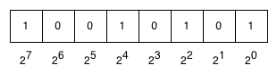
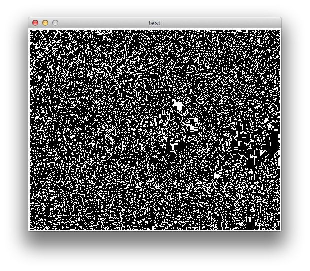

Hiding in Plain Sight
=====================

I have just come home from the 2013 SIGCSE conferece.  The Special Interest Group for Computer Science Education (SIGCSE) conference was in Denver this year.  One of the special features of this years conference was a screening of the movie Codebreaker.  Its a great movie about the life of Alan Turing, one of the fathers of Computer Science, and as the title suggests a pivitol figure in World War II.  Turing broke the code from the Nazi Enigma machine.  Here  is a picture of the machine that I took at the Deutches Museum in Munich Germany in 2011.  Turing was also arrested by the British government because he was gay. He ultimately killed himself; cutting short a life and career far too soon.  You should check out the trailer for the movie at `turingfilm.com <http://www.turingfilm.com>`_.

.. raw:: html

    

This reminded me of a topic that I have wanted to write about for a while now, **Stegnography.**  Take another look at the image of the enigma machine. Look really carefully.  Do you see anything amiss?  Can you find the phrase 'Python Rocks' anywhere in the image?  If you are not familiar with basic image processing check out this section `on image processing <http://interactivepython.org/courselib/static/thinkcspy/MoreAboutIteration/moreiteration.html#dimensional-iteration-image-processing>`_  Its going to come in handy later in this post.

.. actex:: imagefun1

It is there, I promise you.  Lets see if we can find it together.

Here's a silly example of steganography from my personal blog last summer when we were on a cruise and happened to be lucky enough to be part of the filiming of this season's Top Chef.  Of course we were under non-disclosure at the time so I wrote this with added emphasis:

    Last night we had our second phenomenal dinner in Qsine. **this is the restaurant that features the iPads, we were rewArDed by seeing someone faMous at the tAble next to us.** We didn’t intrude on her privacy since she was having dinner with her family and celebrating her father’s birthday.

Of course if you look at bolded sentence closely you will notice there are some odd capital letters.  If you put them all together you will see they spell out PADMA, one of the hosts of Top Chef.  Captitalization is a bit obvious, you can use other techniques like italicizing, or using the first letter of each sentance.  The point is that the message is right there in plain site, for anyone to decode, if they know how you are hiding the message.

Hiding a message in an image is a bit different, and to understand whats going on in the image of the enigma machine lets start with how an image is represented.  The first thing to remember is that every pixel in the image is composed of some red, some green, and some blue.  The values for red, green, and blue are specified as integers in the range 0..255.  why 0 and 255?  Figure 1 shows you an 8 bit binary number.  Its an 8 bit number because there are 8 zeros or ones that make up this number.  The way that we convert a binary number into a decimal number is the following.  Mulitply the number (0 or 1) in the top box by the power of 2 below.

So, for the example in figure we would have:

.. math::

   1 \cdot 2^7 + 0 \cdot 2^6 + 0 \cdot 2^5 + 1 \cdot 2^4 + 0 \cdot 2^3 + 1 \cdot 2^2 + 0 \cdot 2^1 + 1 \cdot 2^0 = 149

The bigest number we can represent in 8 bits would be ``11111111`` or 255.  You do the math.  The smallest number is ``00000000``.  Now, some bits are more important than others.  Which bits in our system have the biggest impact on the magnitude of the number?  The left most bit!  The leftmost bit is either 0 or 1 times :math:`2^7`  Thats a swing of 128 depending on whether that bit is 0 or 1. Therefore we call that bit the **most significant bit**.  On the other hand, the **least significant bit** is the bit on the right because that is just 0 or 1 times :math:`2^0`  which is a swing of only 1.

.. admonition:: Note

   In some computer systems the most significant bit is the one on the left, or is stored at the lowest address when we need more than one byte to represent the number,  but in other computer systems the bit on the right is most significant bit.  Computer systems with the most significant bit on the left are called "big-endian" machines, while those with the most significant bit on the right are called "little-endian" machines.  Most PC's are little-endian machines, while IBM mainframes are big-endian machines.  Also when bits are sent across the network they are sent in big-endian style.  The terms big-endian and little endian come from Gulliver's Travels where the Lilliputians debate whether to eat an egg from the big end or the little end.

So why all this fuss aout most or least significant bits?  When specifying red, green and blue values, how much difference will it make if you change the right-most bit on the amount of red you are adding to a pixel?  It amounts to a change of 0.392 percent.  Less than one half of one percent in the amount of red.  In fact that is less than the human eye can detect, particularly in a system where the human eye doesn't even see individual pixels! -- Yay retina displays!

To send our secret message we are going to take over the least significant bit of the amount of red color information in order to encode an image within an image!  Since we only have a single bit of information to work with our secret image will be a simple black and white image that spells out our secret message.

The algorithm to extract the message is easy.  We iterate over every pixel in our original image.  Get the red value for that pixel.  An easy way to see whether the least significant bit in the pixel is 1 or 0 is to test if the number is odd or even. If the pixel is even we color it white.  If the pixel is odd we will color it black.  The full program is shown below.

.. activecode:: decode1

   import image

   fg = image.Image('secret.png')
   newIm = image.EmptyImage(fg.getWidth(),fg.getHeight())

   for row in range(fg.getHeight()):
       for col in range(fg.getWidth()):
           fgpix = fg.getPixel(col,row)
           fgr = fgpix.getRed()

           if fgr % 2 == 0:
               newPix = image.Pixel(255,255,255)
           else:
               newPix = image.Pixel(0,0,0)
           newIm.setPixel(col,row,newPix)

   win = image.ImageWin(500,400)
   newIm.draw(win)
   win.exitonclick()

Hopefully you got the message.  Now, there are a few caveats to think about with this.  program, in fact if you have python running on your own computer try the following experiment.  Save the original secret image by right clicking and choosing save image as.   Save it as a 'jpg' file instead of a png file.  Now download and run the decode software on your own computer.  If you haven't been through the `image processing section <http://interactivepython.org/courselib/static/thinkcspy/MoreAboutIteration/moreiteration.html#dimensional-iteration-image-processing>`_  then you'll need to go back there and follow the instructions for downloading the ``cImage`` module.  Although thats going to be a bit of work for an experiment that will fail dramatically.  If you convert the image to jpg as I've suggested and run the decode program you'll end up with an image that looks something like this:

   jpeg's algorithms 'lossed' my message.

The reason for this is that the jpeg compression algorithm is called a 'lossy' algorithm.  which means that some of your color information could be lost as the image is compressed.  Although you can't see it with your eye because the jpeg algorithms play exactly the same trick as our steganography does.  They rely on the fact that you can change some of the bits without the viewer being aware of it.  PNG images on the other hand use a lossless compression, this means that you do not lose any information and even our minor 'bit twiddling' is preserved.

Here is a new image, and an image containing the secret message.  See if you can figure out how to create the secret message.

.. actex:: make_message

   import image

Since we have demonstrated that we can use a few bits here and there for our own purposes, its important to realize that we can use these bits to encode anything!  We can use the bits to encode another image, as we have already done, or we can encode text, or audio, or even video.

Encoding a Text Message
-----------------------

Suppose that we wanted to embed a simple text message, rather than an image of some text into our image.  What would we need to do?

1.  We would need a way to represent text in binary form.

2.  We would need a way to embed the binary information in our image.

In answer to question one, there is a longstanding way of representing text in binary called ASCII (American Standard Code for Information Interchange).  Although ASCII is rapidly being supplanted by Unicode, because it is an international standard that supports international character sets, we will stick with ASCII for its simplicity in this example.

ASCII using 7 bits of information to represent the upper case, lower case, and punctuaion characters that you would find on a standard American keyboard.  In fact we can represent 127 different characters. For example a capital 'A' is represented by ``01000001``.  Note that in some kinds of unicode you can use up to 32 bits for a total of

.. fillintheblank:: convert1
   :correct: 65

    Using your new knowledge of converting binary to decimal what is the decimal value of ``010000001``  ___ ?

Python provides us with the ``ord`` function for converting a character to its numeric representation.  In addition there are three functions: ``hex``, ``oct``, and ``bin`` that provide the hexadecimal (base 16), octal (base 8), and binary (base 2) representations of the number.

.. activecode:: ascii

   for ch in "hello world!":
       d = ord(ch)
       b = bin(d)
       print(ch, d, b)

Clearly we can now take some text and represent that text in a numeric format that we can use.  How will we embed this information into an image?  Lets think about it this way.  If we use the least significant bit of the red, green, and blue values for a pixel, we can get three bits per pixel.  So if we used 3 pixels we could store 9 bits which is enough for one character, with two bits left over!

How many characters could we encode in an image?  The images we have used so far in this post have been 500x400 pixels for a total of 200,000 pixels.  That is really quite small by today's standards.  For example a modern iPhone or Android phone can take a picture that is 8 Mega Pixels or over 8,000,000 pixels.  If we divide 200,000 / 3 we see that we could encode 66,666 characters in an image.  Our image is plenty big for a very long email message, while a an 8 MegaPixel image is large enough to encode all of the novel Moby Dick, which is 2,242,843 characters long.

Python's Bit Manipulation Operators
~~~~~~~~~~~~~~~~~~~~~~~~~~~~~~~~~~~

Before we begin to write the function that will encode our text into an image. Lets take a look at the Python operators that allow us to manipulate the bits of a number.  bitwise and, bitwise, or, and shift.

Bitwise **and** and  **or** follow the same idea as logical and and or but apply the concept to individual bits of a number.  In a bitwise and, both bits must be 1 for the result to be 1.  In bitwise or, either bit can be 1 for the result to be 1.  For example here is the bitwise or of two 8 bit numbers: 93 and 199.

::

    0 1 0 1 1 1 0 1
    1 1 0 0 0 1 1 1  or
    ---------------
    1 1 0 1 1 1 1 1

::

    0 1 0 1 1 1 0 1
    1 1 0 0 0 1 1 1  and
    ---------------
    0 1 0 0 0 1 0 1

The bitwise or operator is a single vertical bar ``|`` and the bitwise and operator is the ampersand ``&``.  Now lets verify our results from the example above in activecode.

.. activecode:: bittwiddle1

   print 93 | 199
   print bin(93|199)

   print 93 & 199
   print bin(93 & 199)

Now we can use these operators to our advantage if we want to force a particular bit of a number to be either 0 or 1.  If we want to force the least significant bit of a number to be a 1, leaving all the other bits alone we can do a bitwise or with ``00000001``.  Because we are doing an or with 0 in the first position none of the 7 most significant bits will change their values.  ``0 | 0`` stays zero and ``1 | 0`` stays a 1.  but in the least significant bit either a 0 or a 1 will end up as a 1.  Conversely, if we want to force the least significant bit of a number to be a zero then we can use the bitwise and with ``11111110`` to force the least significant bit to be 0.  ``1 & 1`` remains a 1 while ``0 & 1`` remains a 0.  but ``1 & 0`` or ``0 & 0`` results in a  in the least significant bit.

Although ``bin``, ``hex`` and company provide us with nice string representations of the binary or hexadecimal representation of the bits corresponding to a character, what we really want to do is get at the actual numeric bits so we can store them one at a time in the image.  To do this we can use the shift operator.  The right shift ``>>`` operator can be used in an expression like ``x >> y`` which returns x with the bits shifted to the right by y places.  Using ``x >> 1`` allows us to shift the bits to the right effectively removing the least significant bit, one bit at a time.  Here's a short example of what I mean.

::

    10011 >> 1
    1001 >> 1
    100 >> 1
    10 >> 1
    1 >> 1
    0 >> 1
    0

Now the question is how can we get the value of the least significant bit?  We could use the modulo 2 trick to see if the number is even or odd, or we could use a *bit mask* to get rid of all of all of the bits except for the least significant bit.  To do this is easy, we just use a bitwise and and with binary 1.

::

    >>> 10011 & 00001
    1
    >>> 10010 & 00001
    0

Putting these ideas together we can use shifting and masking to get the bits one at a time from least significant to most significant.

.. activecode:: shiftmask

   x = ord('H')
   print bin(x)

   while x > 0:
       print x & 1
       x = x >> 1

Now to put this to use in hiding a message in an image we need to have some convention for how to store the bits.  A simple proposal is to start with the least significant bit of the first letter and store that bit in least significant bit of red for the upper left pixel.  The second bit gets stored in the last significant bit of green, and the 3rd bit goes in the least significant bit of red.  Then we move to the second pixel in the top row and store the fourth bit in the least significant bit of red, and so on, working our way left to right and top to bottom.

Now, this works out pretty nicely because when we want to decode our message we can again start at the top left and work our way left to right, top to bottom but we will apply the formula :math:`2^n \cdot lsb` where *lsb* is the value of the least significant bit of either red, green, or blue, and n is the number of the bit we are examining.  If we take the pixels in groups of 3 and and the individual bits in groups of 7 we'll have some wasted bits but it will make it quite easy to decode.   I'll provide the encoding function, and leave the decoding function as an exercise for you.

Encoding an ASCII Message using Generators
~~~~~~~~~~~~~~~~~~~~~~~~~~~~~~~~~~~~~~~~~~

A couple of weeks ago I wrote about generators in the prime factor post.  Today I am going to use them again in a really great way.  Of course I could do this without a generators, but the code would be so much more ugly.  And I'll leave it to you as an exercise to provide a non-generator version.  Please Post it in the comments!

Lets start with the main loop.  As we described above we are going to encode our message in the image from left to right and top to bottom.  In the inner loop, we will get the red, green, and blue for a pixel, and then we want to modify the least significant bit of each according to whatever bit comes next in our message.

This becomes a lot easier if we can think of our message as a stream of bits, where we can simply ask a bit provider to give us the next bit to add to the image.  In fact, that is exactly the job of ``bitstream.next()``   Hang on, and we will see how that works in a minute.

Once we have the bit we twiddle the low order bit into either a 0 or a 1 using the setbit function.  When we've modified red, green, and blue for this particular pixel then we add it into a new image.  When we are finally all done, we can save the image with the encoded message to disk.

.. sourcecode:: python

   for row in range(fg.getHeight()):
       for col in range(fg.getWidth()):
           fgpix = fg.getPixel(col,row)
           fgr = fgpix.getRed()
           fgg = fgpix.getGreen()
           fgb = fgpix.getBlue()

           redbit = bitstream.next()
           fgr = setbit(fgr,redbit)

           greenbit = bitstream.next()
           fgg = setbit(fgg,greenbit)

           bluebit = bitstream.next()
           fgb = setbit(fgb,bluebit)

           newPix = myimage.Pixel(fgr,fgg,fgb)
           newIm.setPixel(col,row,newPix)

   newIm.save('ascii_secret.png')

Now lets look at how we get our bitstream.  The source is our bit_generator function.  bit generator takes a string called ``mess`` as a parameter.  It iterates over all the characters in the string, converts each character to its ASCII ordinal value and then takes away the least significant bit and yields it each time through the loop.  Now the yield statement is the thing that makes a generator a generator.  Yield returns a value and then freezes the execution and state of the function until ``next()`` is called again.  Our bit generator operates in three stages:

1.  Return the bits needed for the message
2.  Return 7 0's to indicate that we are at the end of the message
3.  Return a random stream of 0's and 1's so that the main function doesn't have to worry about when we have exhausted all of the bits for our message.

Finally, the ``setbit`` function takes a byte along with a new least significant bit to replace the least significant bit of the byte and returns the new byte.

.. sourcecode:: python

   import random
   mess = input('whats the message? ')

   def bit_generator(mess):
       for ch in mess:
           ascii = ord(ch)
           ct = 0
           while ct < 7:
               yield ascii & 1
               ascii = ascii >> 1
               ct += 1
       for i in range(7):
           yield 0
       while True:
           yield random.randrange(1)

   bitstream = bit_generator(mess)

   def setbit(oldbyte,newbit):
       if newbit:
           return oldbyte | newbit
       else:
           return oldbyte & 0b11111110

If you combine these two listings, along with my secret message and this photo I took in Namibia, Here's what you get.

.. raw:: html

    
     

.. actex:: ascii_solver

   import image

   fg = image.Image('ascii_secret.png')

   # Your code goes here

If you successfully decode the message, post your own message below.  Don't give away the actual secret message, but leave me a clue that you have it right.

.. index::  bit, byte, steganography, lossy compression, lossless compression, image, ascii, binary, shift, binary and, binary or
