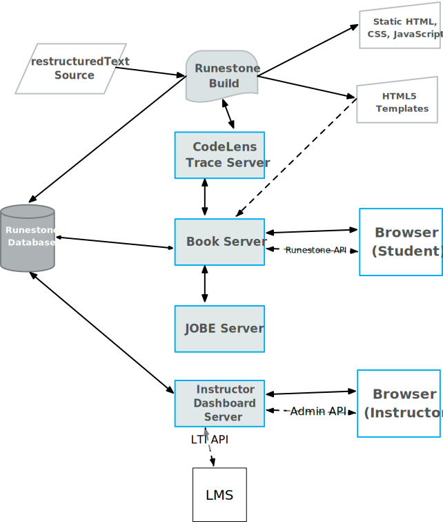

.. _runestone server docs:

************************************************
Developer documentation for the Runestone server
************************************************

:ref:`Runestone server <runestone server docs>`.

Architecture
============

An entire Runestone system consists of several servers as shown in the diagram above. In this section we will briefly describe the major components, the gray items in the diagram.

The Runestone command
---------------------

The runestone command is primarily for authors and allows you to build runestone textbooks.

::

    Usage: runestone [OPTIONS] COMMAND1 [ARGS]... [COMMAND2 [ARGS]...]...

    Options:
    --version  More print version and exit
    --help     Show this message and exit.

    Commands:
    build             Convert rst source into html
    deploy            Copy the results of build to the deployment folder
    doc               Type runestone doc directive to get help on directive
    init              Start a Runestone project
    process-manifest  Process runestone-manifest.xml file
    serve             Run a small development server to *preview* a work in progress

Runestone books can be built in two modes:  Mode one (dynamic) is designed so that books are served with the support of the Book server and its associated APIs.  Mode two is a standalone mode that doesn't save any data, require any logins, and allows you serve content as a simple static website.

Book Server
-----------

The book server routes students to the pages for their course. See `books.py <../controllers/books.py.html>`_ for details on how routing is done.  In general routing involves two important concepts:

1. Base Course -- All runestone courses are based around a textbook.
2. Bespoke Course -- A particular course at an institution will have a name chosen by the instructor, something like python_intro_f20 for example, the python_intro_f20 course is the name used by the students to access their

All bespoke courses map to a base course and the html for that base course is served to students along with some configuration variables inserted for each course at the time the page is served.  This allows us to have a single static copy of each book but serve the book for many individual courses.

Developer's Guide
=================

A Tour of the Source
--------------------
The Runestone Server is built on top of the `web2py <http://web2py.com>`_ application framework.  I know, you've never heard of web2py, why would I do such a thing?  In 2011 it seemed like the right choice.  If I were starting again today it would definitely be a `Flask <http://www.pocoo.org/flask>`_ application.  I still hope to port everything to Flask one day.  But when I think about the opportunity cost of taking an entire summer to port the code versus using the summer to add new features to what is there, I lean heavily towards the new thing.  Eventually all of the bad decisions and shortcuts I've taken over the years will force me to do a rewrite.

Ok, with that out of the way, lets look at the structure of the source.  Web2py enforces a particular directory structure on your project and once you understand it, it is actually pretty nice.   The really important parts of the directory structure map directly to web2py's strictly enforced Model-View-Controller view of web development.   Here is an overview, with details to follow

::

    web2py/
        web2py.py
        applications/
            welcome/
            runestone/
                models/
                    0.py
                    1.py
                    db.py
                    db_ebook.py
                controllers/
                    ajax.py
                    default.py
                    admin.py
                views/
                    layout.html
                    index.html
                    generic.html
                    generic.json
                    default/
                        about.html
                        profile.html
                    admin/
                        showassignments.html
                errors/
                databases/

The web2py.py application folder is what you get when you download web2py from web2py.com.  All web2py applications have their own folder inside the web2py applications folder.  Out of the box, web2py comes with a welcome app, and this is where you clone the RunestoneServer repository to the the runestone folder.

Three critical folders inside runestone are the models, views, and controllers folders.  The models folder is where you write your table definitions for any database tables you are using in your application.  The files in the model folder are loaded in alphabetical order, so if you have some tables that depend on others you can control the order they are loaded by naming the files appropriately. Importantly, 0.py and 1.py are loaded right away and typically contain configuration information.  There is also a `databases` folder where web2py keeps track of meta information about each table.  it uses this to detect when you have made a schema change and will automatically do its best to update the tables in the database and migrate any data to the new schema.  You should never edit any of these files, or you will cause more trouble than its worth.

The controllers folder contains all of the endpoints for making application requests.  Routing is done by a simple naming convention as follows:  `/application/controller_file/function`. So a request to /`runestone/ajax/hsblog` would cause the hsblog function defined inside ajax.py in the controllers folder to be called.  For runestone all of the API calls used by the Javascript make calls to functions inside of ajax.py.

Every controller file may have a folder with the same name under the views folder.  Each function in a controller may have a corresponding html file inside said folder.  An example:  Suppose you have a controller `/runestone/admin/listcourses` The list courses function would get all of the database information needed to list all of the courses and store that information in a python dictionary.  The listcourses function returns that dictionary, and web2py marries that information with the template file in `/runestone/views/admin/listcourses.html`. The only time your would not have a corresponding html file is when your controller is meant to return JSON or XML.  In this case you should make the request to `/runestone/ajax/foo.json`. This will ensure that the foo function in ajax is called, and the .json extension lets web2py know to set up the content-type headers to indicate that it is JSON coming back.  If you do not have an html file in your view folder web2py will default to `generic.html` file in the main views folder.  This actually works fine when you are prototyping as web2py does a decent job of trying to display whatever stuff you send it in a dictionary.

Generally the  web2py templating system is a lot like Jinja2, but with a couple of syntactic differences to get used to.  For example whereas in Jinja you can reference a variable like `{{foo}}` in web2py you need to say `{{=foo}}`

More about web2py
-----------------

Generally the web2py documentation is pretty good, if you are confused after looking at our code you can check out either of the links below.  It might also be a good idea to just work through your own really `simple examples <http://www.web2py.com/init/default/examples>`_.  For more reference style documentation check out either of the following:

* `web2py.readthedocs.io <http://web2py.readthedocs.org>`_
* `www.web2py.com/book <http://www.web2py.com/book>`_

Unit Testing
------------

We have a pretty good set of unit tests that we really want to grow into a full blown full coverage set of tests.  For documentation, see `tests/README.rst`.

We have a Travis-CI job set up to automatically test all PR's if your pull request does not pass it won't be accepted.

Please take a look at the unit tests we have, and write a new one that demonstrates that your feature or enhancement works.

I know it's more fun to just add features, but with a small group it is more important than ever to have comprehensive unit tests.  It's the only way we can quickly accept new features and have any confidence that it won't break runestone.academy for 1000's of people!

Major Feature Contributions
---------------------------

There are many ways that we can continue to improve and make the Runestone platform great, and I am excited to see the platform evolve.  What I would ask is that if you have a large new feature that you would like to propose / contribute please start by creating an issue.  This will allow us to discuss it together up front, consider the design implications, and make it more likely that the PR will be accepted with a minimum of fuss.

Runestone has grown organically over the years but that has led to duplicated tables in the database duplicated code and lots of inconsistency.  We need to start working to change all of that if we are going to continue to grow runestone efficiently.

Style
-----

We have adopted the `black` program for helping to keep our code a consistent style.  It is installed when you install the `requirements-dev.txt` set of packages.  Many editors can be configured to run `black` when you save your file.  If not you should run it on any files you have edited **before** you make a pull request.  Our CI test suite runs both `black` and `flake8` to find any potential style or lint errors. -- I know this is an extra step, but having a consistent style makes life easier for everyone.

Overview Material
=================
.. toctree::
    :maxdepth: 2

    docs/installation
    docs/lti
    docker/toctree
    rsmanage/toctree

web2py server
=============
.. toctree::
    :maxdepth: 2

    /models/toctree
    /controllers/toctree
    /views/__init__.py
    /modules/__init__.py

Tests and CI
============
.. toctree::
    :maxdepth: 2

    /.travis.yml
    /.coveralls.yml
    /tests/__init__.py

Documentation
=============

This is the beginning of developer documentation for the Runestone server. To build these documents:

#.  Open a terminal or command prompt and change to the root of this repository.
#.  `Install Poetry <https://python-poetry.org/docs/#installation>`_.
#.  Install this project's dependencies: at a command line, execute ``poetry install``.
#.  Execute ``poetry run sphinx-build -d _build/doctrees . _build``.

There's a lot of work left to do. In particular:

-   All comments are interpreted as ReST, per the `CodeChat docs <https://codechat.readthedocs.io/en/master/docs/style_guide.cpp.html>`_. **Read this first!** All the style suggestions should be following when documenting this project.
-   Every source file should start with a title, typically like this:

    .. code-block:: Python

        # ***********************************************
        # |docname| - A one-line description of this file
        # ***********************************************

    As an example, see `/controllers/books.py`.

-   After this, all existing errors and warnings produced by running Sphinx should be fixed.

Other files
===========
.. toctree::
    :maxdepth: 2
    :glob:

    docs/lti
    CONTRIBUTING
    ChangeLog
    scripts/toctree
    __init__.py
    .prettierrc.js
    conf.py
    pyproject.toml
    runestone_poetry_project/__init__

Indices and tables
------------------
* :ref:`genindex`
* :ref:`search`
