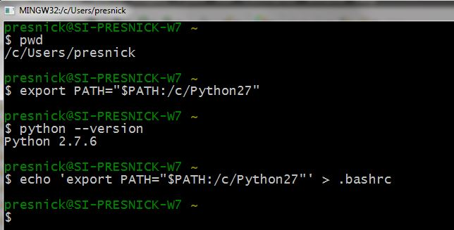
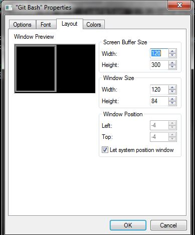
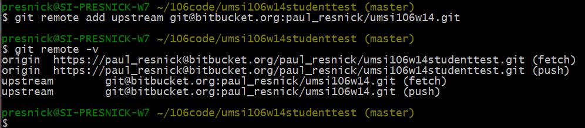
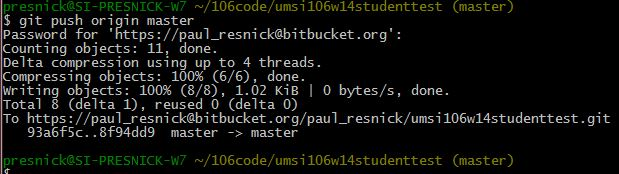

..  Copyright (C)  Paul Resnick.  Permission is granted to copy, distribute
    and/or modify this document under the terms of the GNU Free Documentation
    License, Version 1.3 or any later version published by the Free Software
    Foundation; with Invariant Sections being Forward, Prefaces, and
    Contributor List, no Front-Cover Texts, and no Back-Cover Texts.  A copy of
    the license is included in the section entitled "GNU Free Documentation
    License".

..  shortname:: Installation
..  description:: Installing python and git

.. qnum::
   :prefix: installation-
   :start: 1
   
.. _installation_chap:

Preparing Your Computer for the Rest of the Course
==================================================

It has been convenient to be able to execute python code right in the browser. To write and
execute bigger programs, to use modules beyond the few that have been implemented for this
environment, and to perform file and network operations, you will need to
run python *natively* on your computer.

We will walk you through the process of setting up your computer to do that. It will
involve the following steps:

1. Create a directory (folder) where your code for this course will live.

#. Install and configure a text editor

#. Install and configure python

#. Install and configure git on your computer

#. Fork and Clone the git repository for code samples and exercises

The instructions diverge here for the first four steps, depending on whether you are on Windows or a Mac. (If you're on
Linux, we presume that you know what you're doing already and can make appropriate
improvisations from the instructions for Windows or Mac.) Once your basic environment
is set up, you will Clone the git repository in the same way on either platform.

* :ref:`Windows instructions <windows_install>`

* :ref:`Mac instructions <mac_install>`

* :ref:`Fork and Clone the git repository <git_repos>`

.. _windows_install:

Windows Instructions
====================

Install and configure a text editor
-----------------------------------

You will need a text editor. There are many options for this. For example, serious
programmers often use Eclipse. But we do not recommend it for beginniners. There's too much stuff to configure. Definitiely **do not** try using MS Word, because
it doesn't save documents as plain text, and it doesn't do any syntax highlighting or
other useful things. 

The editor that we will help you to use is called NotePad++. Please download it from
`this site <http://notepad-plus-plus.org/download/>`_. Download it and then run the installer to install NotePad++.

.. note::

   Important! Before you create your first program, you need to make one small change in the Preferences for NotePad++. This will save you lots of "Python indent errors" anguish later. 
   Under Settings -> Preferences -> Language Menu/Tab Settings tick the check box for "Expand Tabs" leaving the value at "4" and 
   press the "Close" button.
   
   .. image:: Figures/tabs.JPG

Follow the instructions below. It will be 
quite intuitive. The one thing to keep in mind is that NotedPad++ is an environment
for creating python programs. It doesn't run them! You'll have to install a little
more stuff to make that work, as described in later sections.
(If you'd like to see a demonstration of NotePad++, Dr. Chuck has a screen cast for the use of NotePad++. 
You can either view this `on YouTube <http://www.youtube.com/watch?v=o0X-VHX6ls0>`_ or you can download the high-quality `QuickTime version <http://www-personal.umich.edu/~csev/courses/shared/podcasts/windows-python-notepad-plus.mov>`_ 
of the screen cast. You will need Apple QuickTime installed to view this video. )

Start NotePad++ from either a Desktop icon or from the Start Programs menu and enter your first Python program into NotePad++:

.. image:: Figures/helloworld.JPG
      :width: 300px
    
Save your program as firstprog.py. You can save it anywhere. In a little while we'll
create a code folder in a convenient place on your machine and you can resave the file then. 
You will notice that after you save the file, NotePad++ will color your code based on the Python syntax rules. 
Syntax coloring is a very helpful feature as it gives you visual feedback about your program and can help you track down syntax errors more easily. 
NotePad++ only knows that your file is a Python file after you save it with a ".py" suffix.

.. image:: Figures/firstprog.JPG
      :width: 300px

Install and configure python
----------------------------

Please download and install Python 2.7 from:

http://python.org/download/releases/2.7.6/

Download and install the file python-2.7.6.msi - when the install process asks you which directory to use - make sure to keep the default directory of C:\Python27\. If you are not sure if your Windows is 64-bit - install the 32-bit version of Python, the
one that just says, "Windows x86 MSI Installer (2.7.6) (sig)".

.. note::

   Make sure that you install the latest version of Python 2.x - do not install Python 3.x. 
   There are signficant differences between Python 2 and Python 3 and this book/site is based on Python 2.

With just this installation, you can get an interactive python interpreter where
you can type code one line at a time and have it executed. You may find some options
on the Windows menu for this, such as Idle.

With just this installation it is also possible to run python from the Windows command prompt. 
But the Windows command prompt is tricky to deal with. To establish
greater consistency with the environment in which Mac users will be working and 
because it's just a better command prompt, we will wait until after installing git
and use the git bash shell to invoke python. Coming right up in the next section.

Install and configure git on your computer
------------------------------------------

git is a tool for working with other people on writing code and other documents. 
It's really valuable to know
how to use it, because it will let you start working easily with other people 
you haven't worked with before, at hackathons, for example. We will be learning
the very basics of git in this course, and using it to distribute code and problem sets and for you to turn in 
your problem sets.

Install `git for Windows <http://msysgit.github.io/>`_. (Click on Download. All of the options say preview and beta.
Don't worry about that. It's stable enough for our use. Do choose a "featured" download, currently "Full installer for official Git for Windows 1.9.0".)

.. note::
   
   Don't change any of the default configurations during the installation! Most importantly, leave the setting on "Checkout windows-style, commit unix-style line endings."
   
Once you have completed the installation, do the following steps:

#. Launch the program Git Bash in the usual way that you launch Windows programs. A shortcut for Git Bash was created during installation.

#. At the command prompt, paste this command ``export PATH="$PATH:/c/Python27"``. That will tell Windows where to find Python. (This assumes that you installed it in C:\Python27, as we told you to above.)

#. Check to make sure that this worked correctly by entering the command ``python --version``.  It should say Python 2.7.6, as shown in the figure below.

#. Assuming that worked correctly, you will want to set up git bash so that it always knows where to find python. To do that, enter the following command: ``echo 'export PATH="$PATH:/c/Python27"' > .bashrc``. That will save the command into a file called .bashrc. .bashrc is executed every time git bash launches.

#. Check to make sure that worked by typing exit, relaunching git bash, and then typing ``python --version`` again.

Choosing the location for your code folder
------------------------------------------

When you start git bash, you will be connected to a folder like /c/Users/presnick, which corresponds
to the Windows file path c:\Users\presnick. Of course, instead of presnick, it will
be your Windows username. To see what directory you are in, at the command prompt you
can type ``pwd``.

When you use git, as described further on, a subdirectory will be created for you automatically. If you want that subdirectory to be underneath c:\Users\<yourWindowsUsername>, then you need do nothing else right now. That's what I recommend. If you want it to be somewhere else, you will need to figure out the correct "path" to it, and figure out how to translate that path into the unix format so that you can issue the appropriate ``cd`` command. (I have chosen to put my code in c:\Users\presnick\106code, which translates in to /c/Users/presnick/106code in the unix path format.)

#. Go back to Notedpad++ and resave firstprog.py into c:\Users\<yourWindowsUsername>. You can navigate to that directory when doing a Save As in NotePad++ by starting at C:, then going to Users, then your Windows username.

#. The unix command for listing the contents of a directory is ls. In git bash, type ``ls``. You should now see firstprog.py is a file in that directory. You may see lots of other files as well, if you stayed in the default location of /c/Users/<yourWindowsUsername>.

#. At gitbash, type ``python firstprog.py``. It should print out ``hello world`` as shown in the figure.

.. image:: Figures/directory.JPG

A few git bash tips
-------------------

Here are a few tips that make it easier to work with git bash.

#. If you hit the up-arrow key or ctrl-P, it retrieves the previous command that you entered. Do it repeatedly to get to earlier commands in your history. Once you find a command you like, hit Enter to execute it again, or you can edit it.

#. While entering a command, in many situations you can hit Tab to auto-complete the thing that you were typing. For example, if you start typing ``python fir`` and then hit tab, it will auto-complete it for you.

#. Close the git bash window by typing ``exit``. This is the best way to close it because it will remember your past commands in the history when you restart the program.

Customize the git bash display a little
---------------------------------------

There are a couple more configuration changes that I highly recommend. You don't absolutely have
to do these, but they're very useful. Most importantly, they will allow you to cut
and paste in the git bash window.

#. Close the git bash window if you haven't already.

#. In the Windows menu, right click on git bash and choose "Run as Administrator". This will allow you to change some of the configurations.

#. Right click on the icon in the upper left of the git bash window and choose properties.

#. Check the box for Quick Edit Mode. That will let you copy and paste text in the window.

#. Change the buffer size to 999. That way it will remember 999 commands in your history.

#. Under the Layout Tab, you may want to make a wider width. I've chosen 120 characters. I also chose a bigger font size for myself, but you may be fine with default font.

#. Click OK. 

.. image:: Figures/gitbashprops1.JPG

Congratulations. You are ready to write and execute python code natively on your computer. Now skip down to the section on working with :ref:`Git repositories <git_repos>`.

.. _mac_install:

Mac Instructions
================

Jackie: can you try filling this in, in the same style as above? I expect it will be a *lot* shorter. You might want to use http://pythonlearn.com/software-mac.php as a resource. 

.. _git_repos:

Fork and clone the git repository for code samples and exercises
================================================================

Finally, you will need to get set up for downloading code for in-class exercises and for problem sets, and for uploading your problem sets for grading.

Concepts and Vocabulary
-----------------------

git is a tool for keeping track of collections of files, and tracking multiple versions of them. The whole collection of files is called a **repository**, or **repo** for short. A **commit** defines a snapshot of the state of all the files. You can work locally, in your **working directory** with files and then, when you have them all cleaned up, you create a new commit, with a commit message that is a comment describing what you have changed since the last commit. 

You can **checkout** different commits the repository, and revert back to earlier versions, though we won't be teaching you how to do that (yet).

You can also **merge** in changes to files that other people make. git does pretty well at automatically merging changes, but sometimes it isn't sure what was intended and you have to do that process manually. Next week we'll teach you how to do that. Hopefully, we will get through this week without needing to do any merges.

We say that one repository is a **fork** of another if it starts with the complete history of the other repository at some point in time. After the time of the fork, the two repositories may diverge. We have a main repository for the course code. You will make a fork of that repository and make changes to it, such as adding your problem set answers. You will also pull in any new code that gets added to the original repository of course code by setting up the original repository as an **upstream** repository.

Repositories can be synchronized across computers. A common setup, and one that we will use in the course, is to keep a **remote** copy of a repository on an Internet-accessible server, and keep a local repository on your private computer. We will use a free service on the Internet called BitBucket to keep the remote copies of our repositories. To make an initial copy of a repository, we **clone** the repository. To synch any changes that other people might have made to the remote copy, we **pull** those changes from the remote. To synch any changes that we made, so that others can see them, we **push** those changes to the remote.

Make a personal fork of the class code repository on bitbucket
--------------------------------------------------------------

#. First, you will need to create an account for yourself on https://bitbucket.org/

#. Once you are logged in, go to https://bitbucket.org/paul_resnick/umsi106w14

#. Next, fork the repository (don't clone it). To do that, click on the three dots... icon near the upper right, and select fork.

.. image:: Figures/fork.JPG
   :width: 600px

.. note::

   Make sure to check the boxes for "This is a private repository" and "Inherit repository user/group permissions". The second one of those will allow the instructors to upload commented code files to your repository as part of the grading process.

   
.. image:: Figures/forkconfig.JPG
    :width: 600px

Clone your bitbucket repository to your local machine
-----------------------------------------------------
   
4. Open a command prompt window (or git bash window on Windows) and cd to the directory 106code    
   
5. When you are on the page on bitbucket for your newly forked repository. Click on Clone (not fork), then on HTTPS: Copy all of the selected text. (Note: if you use the SSH rather than HTTPS option, you won't have to enter your bitbucket password every time you pull or push code with bitbucket. But that requires setting up SSH cryptographic keys, which can be quite confusing for the novice. You're welcome to try it, but you're on your own for that. See documentation at https://confluence.atlassian.com/display/BITBUCKET/Set+up+SSH+for+Git)

.. image:: Figures/clone.JPG
   :width: 600px

6. Paste that text into the command window and run it. You will be prompted for your bitbucket password. 

.. image:: Figures/clone2.JPG
   :width: 600px

7. Now ``cd`` to the subdirectory that was created. Type ``ls`` and you should see some code there. 

8. One more step, so that you will be able to pull in new code that we put into the original repository that you forked. Make sure you are in the subdirectory (i.e., make sure you did the previous step). Then copy and paste this command: ``git remote add upstream git@bitbucket.org:paul_resnick/umsi106w14.git``. Then type ``git remote -v``. You should see something like the output below, with an upstream defined.

9. Check to make sure the upstream is all set up by typing ``git pull upstream master``. It should tell you that you already up-to-date, as in the output below.

.. image:: Figures/pullupstream.JPG
   :width: 600px

Congratulations, your local clone of the remote git repository is set up properly.

Make changes locally
--------------------

Now you can make changes to the code files in your directory. To test that you have everything working, let's go through changing a file and adding a new file.

1. Pull up the file secondprog.py in your text editor. Change it so that instead of printing "Hello, world", it prints "Hello me". Save the file.

2. Create a third file thirdprog.py in your text editor and save it.

Commit your changes locally
---------------------------

1. At the command prompt, type ``git status``. You should get an ouput like what you see below. It's telling you that secondprog.py has been modified, and that there's a new file, thirdprog.py, in the directory that isn't currently being tracked by git.

2. Type ``git add secondprog.py``.

3. Type ``git add thirdprog.py``.

.. image:: Figures/gitstatus1.JPG
 
4. Type ``git status`` again. Now it shows that the two files are "staged", ready to be committed.

5. Type ``git commit -m"<a comment describing what changes you have made since the last commit goes here>"``

6. Type ``git status`` one more time. Now it says there is nothing to commit and the working directory is clean.
 
.. image:: Figures/gitstatus3.JPG

Push your changes to bitbucket
------------------------------

Whenever you make a commit, we recommend that you push the code repository back to bitbucket. You **have** to do that to turn in your problem sets. And it's a good idea to do it more often as a way of backing up your code to a remote server.

1. Type ``git push origin master``  (Origin means send it back to the original location where you got it from, at bitbucket. master means to send the "master" branch. We are not teaching you about branches in this gentle introduction to git, so don't worry about that: you will always be working with the master branch.)

.. image:: Figures/gitstatus4.JPG

2. Check on bitbucket by visiting the page for your repository and clicking on "Source". You can see that your code files have now made it to their servers. You can even click on the individual code files to see their contents.

.. image:: Figures/bitbucketafterpush.JPG
   :width: 600px

Summary of your regular workflow
--------------------------------

1. Each working session begins with a clean working directory. Check to make sure that you finished your last session, by typing ``git status``. If it shows changed files that still need to be commited, resolve that before getting started.

2. Pull in any code updates from the instructors, by typing ``git pull upstream master``.

3. Edit your files.

4. Add new and changed files with ``git add ...`` commadns.

5. Commit your changes locally with ``git commit ...``.

6. Push your changes to bitbucket with ``git push origin master``