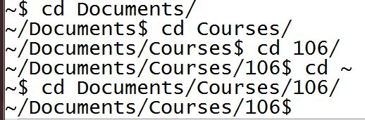

..  Copyright (C)  Brad Miller, David Ranum, Jeffrey Elkner, Peter Wentworth, Allen B. Downey, Chris
    Meyers, and Dario Mitchell.  Permission is granted to copy, distribute
    and/or modify this document under the terms of the GNU Free Documentation
    License, Version 1.3 or any later version published by the Free Software
    Foundation; with Invariant Sections being Forward, Prefaces, and
    Contributor List, no Front-Cover Texts, and no Back-Cover Texts.  A copy of
    the license is included in the section entitled "GNU Free Documentation
    License".

.. _folders_and_paths_sect:

Directories and Paths
---------------------

When you navigate through the files on your computer, you probably click on folder icons. You can save files in folders, also known as **directories**, and you can create directories within other directories.

Navigating through the Unix file system means you are going from one directory to another in the command line interface on your computer (in this class, probably using the application **Terminal**, if you use a Mac, or **Git Bash**, if you use Windows).

Directories map to **paths**. A path is text that describes exactly what location something is in your file system on your computer. For example, if my computer account is called ``Jackies-Laptop``, the path to my **Desktop** directory is ``Users/Jackies-Laptop/Desktop``. (The Desktop folder is just a directory like any other on your computer. The operating system displays all the contents of that particular directory on your home screen background.)

When you are in a command prompt window, you are always connected to some particular directory. When you open the window, you start out at your home directory. You can see where you are by looking at the string in the prompt. For example, this is what it looks like in a Desktop directory:

.. image:: Figures/promptstring.JPG

The stuff before the $ indicates that you are connected to the ~/Desktop directory. After the $ is a blinking cursor, indicating that you are free to type in a new command there.

Unix Commands: cd and ls
------------------------

From there, you can use commands to move to other directories. The ``cd`` command stands for "change directory." After the letters cd and a space, you will type a path string that specifies the directory to connect to.

Starting a path with ``/`` means you're providing a **full path**. For example, if you have a path such as ``/Users/kniznica/Desktop``, you can type ``cd /Users/kniznica/Desktop`` to connect to that directory.

The symbol ``~`` refers to your **home directory**. For example, if your username that you use to logon to the computer is kniznica, your home direcdtory might be ``/Users/kniznica``. To connect to your home directory, you would type ``cd ~``, or spell it out as ``cd Users/kniznica``. The advantage of ``cd ~``, beyond being shorter, is that you don't have to remember the full path name of your home directory.

You can also use ~ as a prefix in a longer pathname. Usually, your Desktop folder will be a subdirectory of your home directory. Thus, you could type, ``cd ~/Desktop``.

If the path you specify does not begin with either ~ or /, then it is a **relative path**, relative to where you are right now. It specifies a subdirectory of the current directory. Thus, for example, suppose your home directory contains a ``Documents`` subdirectory, which contains a directory called ``106``. Suppose you are currently connected to the home directory (cd ~). Then you could type ``cd Documents`` to connect to the Document directory, or ``cd Documents/106`` to connect to the 106 directory. Alternatively, starting from your home directory, you could go in two steps, ``cd Documents``, then ``cd 106``. In my case, I have one more layer of directories in the hierarchy: with 106 being a subdirectory of Courses, which is a subdirectory of Documents, as shown in the Figure below.

Now, if you are connected to this ``106`` directory, and all it has in it is document files of notes you take in class and screenshot images, you cannot do ``cd Documents`` -- you can try, but it will not work. Once you are **in** ``106``, ``cd Documents`` is trying to find a subdirectory of 106 named Documents, which doesn't exist.

If you want to go back up one level in the file structure, from a subdirectory to the containing directory, there is a syntax especially for that: ``cd ..``. So if you are at ``~/Documents/106`` and now you want to go back to the ``Documents`` directory in your command prompt, you would type ``cd ..`` at the prompt. If you wanted to go up two levels, back to your home directory, you would type ``cd ../..``. Of course, if the final destination is your home directory, you could just type ``cd ~``. 

Once you've reached a directory, there are a lot of powerful unix commands you can use that act on the contents of the current directory. The next one we'll discuss is ``ls``, which is a command that lists all files that are in your current folder. (The directory, or folder, that you're **currently in** in the command prompt is often referred to as your **working directory**.) 

``ls`` is a way to list a directory's contents. For example, now that we have gone to a folder, ``ls`` will display a list like this:

.. image:: Figures/lsexample.JPG

Here's the view of the same directory in Windows Explorer:

.. image:: Figures/ lsInWindowsExplorer.JPG

Of course, the visual display is easier for people to read. But later in the course you will need to navigate through your directories using the command prompt, and it will be helpful for you to see contents of directories in the command prompt as well.

You can provide a path string after the ls command. That will show the contents of the specified directory, *without changing the directory that you're currently connected to*. For example, ``ls ~/Desktop`` will show the contents of the Desktop directory, without connecting to it.

**Check your understanding**

.. mchoicema:: test_question_unix_ls_1
   :answer_a: cd /c/Users/presnick/Documents
   :answer_b: cd presnick/Documents
   :answer_c: cd Documents
   :answer_d: cd ~
   :answer_e: cd ~/Documents
   :correct: a,d,e
   :feedback_a: It starts with a /.
   :feedback_b: This specifies the presnick subdirectory of the current directory and the Documents subdirectory of that. 
   :feedback_c: This specifies the Document subdirectory of the current directory.
   :feedback_d: This specifies the home directory.
   :feedback_e: This specifies the Documents subdirectory of the home directory

   Which of the following commands specify absolute paths?

.. mchoicema:: test_question_unix_ls_2
   :answer_a: cd /c/Users/presnick/Documents
   :answer_b: cd presnick/Documents
   :answer_c: cd Documents
   :answer_d: cd ~
   :answer_e: cd ~/Documents
   :correct: b,c
   :feedback_a: It starts with a /.
   :feedback_b: This specifies the presnick subdirectory of the current directory and the Documents subdirectory of that. 
   :feedback_c: This specifies the Document subdirectory of the current directory.
   :feedback_d: This specifies the full path of the home directory.
   :feedback_e: This specifies the full path of the Documents subdirectory of the home directory

   Which of the following commands specify relative paths? 
