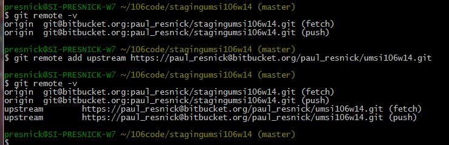

..  Copyright (C)  Brad Miller, David Ranum, Jeffrey Elkner, Peter Wentworth, Allen B. Downey, Chris
    Meyers, and Dario Mitchell.  Permission is granted to copy, distribute
    and/or modify this document under the terms of the GNU Free Documentation
    License, Version 1.3 or any later version published by the Free Software
    Foundation; with Invariant Sections being Forward, Prefaces, and
    Contributor List, no Front-Cover Texts, and no Back-Cover Texts.  A copy of
    the license is included in the section entitled "GNU Free Documentation
    License".

Clone your bitbucket repository to your local machine
-----------------------------------------------------

.. note::

   In the instructions below, wherever the examples refer to the a command prompt, that's either the git bash shell (Windows) or Terminal window (Mac). Interestingly, in both cases it's a version of the bash shell. In the book about open source that you'll be reading and discussing for the second half of the semester, you'll learn a little bit of the history of the bash shell.

4. Open a command prompt window. If necessary, cd to the base directory that you want your code directory to be under.    
   
5. Use a web browser to get to the page on bitbucket for your newly forked repository. Click on Clone (not fork), then on HTTPS: Copy all of the selected text. (Note: if you use the SSH rather than HTTPS option, you won't have to enter your bitbucket password every time you pull or push code with bitbucket. But that requires setting up SSH cryptographic keys, which can be quite confusing for the novice. You're welcome to try it, but you're on your own for that. See documentation at https://confluence.atlassian.com/display/BITBUCKET/Set+up+SSH+for+Git)

.. image:: Figures/clone.JPG
   :width: 600px

6. Paste that text into the command window and run it. You will be prompted for your bitbucket password. 

.. image:: Figures/clone2.JPG
   :width: 600px

7. Now ``cd`` to the subdirectory that was created. Type ``ls`` and you should see some code there. 

8. One more step, so that you will be able to pull in new code that we put into the original repository that you forked. Make sure you are in the subdirectory (i.e., make sure you did the previous step). Then copy and paste this command: ``git remote add upstream https://paul_resnick@bitbucket.org/paul_resnick/umsi106w14.git``. Then type ``git remote -v``. You should see something like the output below, with an upstream defined.

.. note:: 

   We previously provided instructions that said to use ``git@bitbucket.org:paul_resnick/umsi106w14.git`` instead of the https url. That was causing errors at a later step. If you followed the old instructions, please enter the command ``git remote remove upstream`` and then redo this step.

9. Check to make sure the upstream is all set up by typing ``git pull upstream master``. It should tell you that you already up-to-date, as in the output below.

.. image:: Figures/pullupstream.JPG
   :width: 600px
   
.. note::
   
   Depending on your version of git, when you do ``git pull upstream master``, it may prompt you to make a commit message, using a very confusing editor called vi. It will say something like ``# Please enter a commit message to explain why this merge is necessary...``. If that happens to you, I suggest that you exit the vi editor by typing ``:q``. That will probably cancel (abort) the git pull. Try it again like this: ``git pull upstream master --no-edit``. 

Congratulations, your local clone of the remote git repository is set up properly.

