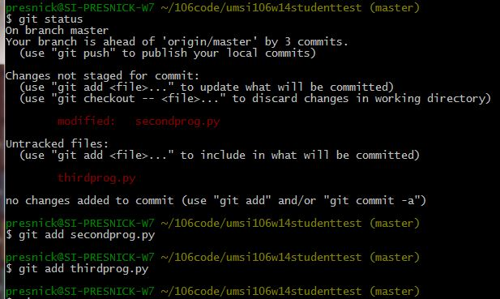
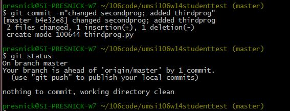

..  Copyright (C)  Brad Miller, David Ranum, Jeffrey Elkner, Peter Wentworth, Allen B. Downey, Chris
    Meyers, and Dario Mitchell.  Permission is granted to copy, distribute
    and/or modify this document under the terms of the GNU Free Documentation
    License, Version 1.3 or any later version published by the Free Software
    Foundation; with Invariant Sections being Forward, Prefaces, and
    Contributor List, no Front-Cover Texts, and no Back-Cover Texts.  A copy of
    the license is included in the section entitled "GNU Free Documentation
    License".

Commit your changes locally
---------------------------

1. At the command prompt, type ``git status``. You should get an ouput like what you see below. It's telling you that secondprog.py has been modified, and that there's a new file, thirdprog.py, in the directory that isn't currently being tracked by git.

2. Type ``git add secondprog.py``.

3. Type ``git add thirdprog.py``.

 
4. Type ``git status`` again. Now it shows that the two files are "staged", ready to be committed.

.. image:: Figures/gitstatus2.JPG

5. Type ``git commit -m"<a comment describing what changes you have made since the last commit goes here>"``

6. Type ``git status`` one more time. Now it says there is nothing to commit and the working directory is clean.
 

