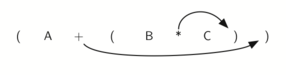
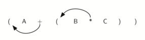

..  Copyright (C)  Brad Miller, David Ranum, Jeffrey Elkner, Peter Wentworth, Allen B. Downey, Chris
    Meyers, and Dario Mitchell.  Permission is granted to copy, distribute
    and/or modify this document under the terms of the GNU Free Documentation
    License, Version 1.3 or any later version published by the Free Software
    Foundation; with Invariant Sections being Forward, Prefaces, and
    Contributor List, no Front-Cover Texts, and no Back-Cover Texts.  A copy of
    the license is included in the section entitled "GNU Free Documentation
    License".

Infix, Prefix and Postfix Expressions
~~~~~~~~~~~~~~~~~~~~~~~~~~~~~~~~~~~~~

When you write an arithmetic expression such as B \* C, the form of the
expression provides you with information so that you can interpret it
correctly. In this case we know that the variable B is being multiplied
by the variable C since the multiplication operator \* appears between
them in the expression. This type of notation is referred to as
**infix** since the operator is *in between* the two operands that it is
working on.

Consider another infix example, A + B \* C. The operators + and \* still
appear between the operands, but there is a problem. Which operands do
they work on? Does the + work on A and B or does the \* take B and C?
The expression seems ambiguous.

In fact, you have been reading and writing these types of expressions
for a long time and they do not cause you any problem. The reason for
this is that you know something about the operators + and \*. Each
operator has a **precedence** level. Operators of higher precedence are
used before operators of lower precedence. The only thing that can
change that order is the presence of parentheses. The precedence order
for arithmetic operators places multiplication and division above
addition and subtraction. If two operators of equal precedence appear,
then a left-to-right ordering or associativity is used.

Let’s interpret the troublesome expression A + B \* C using operator
precedence. B and C are multiplied first, and A is then added to that
result. (A + B) \* C would force the addition of A and B to be done
first before the multiplication. In expression A + B + C, by precedence
(via associativity), the leftmost + would be done first.

Although all this may be obvious to you, remember that computers need to
know exactly what operators to perform and in what order. One way to
write an expression that guarantees there will be no confusion with
respect to the order of operations is to create what is called a **fully
parenthesized** expression. This type of expression uses one pair of
parentheses for each operator. The parentheses dictate the order of
operations; there is no ambiguity. There is also no need to remember any
precedence rules.

The expression A + B \* C + D can be rewritten as ((A + (B \* C)) + D)
to show that the multiplication happens first, followed by the leftmost
addition. A + B + C + D can be written as (((A + B) + C) + D) since the
addition operations associate from left to right.

There are two other very important expression formats that may not seem
obvious to you at first. Consider the infix expression A + B. What would
happen if we moved the operator before the two operands? The resulting
expression would be + A B. Likewise, we could move the operator to the
end. We would get A B +. These look a bit strange.

These changes to the position of the operator with respect to the
operands create two new expression formats, **prefix** and **postfix**.
Prefix expression notation requires that all operators precede the two
operands that they work on. Postfix, on the other hand, requires that
its operators come after the corresponding operands. A few more examples
should help to make this a bit clearer (see :ref:`Table 2 <tbl_example1>`).

A + B \* C would be written as + A \* B C in prefix. The multiplication
operator comes immediately before the operands B and C, denoting that \*
has precedence over +. The addition operator then appears before the A
and the result of the multiplication.

In postfix, the expression would be A B C \* +. Again, the order of
operations is preserved since the \* appears immediately after the B and
the C, denoting that \* has precedence, with + coming after. Although
the operators moved and now appear either before or after their
respective operands, the order of the operands stayed exactly the same
relative to one another.

.. _tbl_example1:

.. table:: **Table 2: Examples of Infix, Prefix, and Postfix**

    ============================ ======================= ========================
            **Infix Expression**   **Prefix Expression**   **Postfix Expression**
    ============================ ======================= ========================
                           A + B                  \+ A B                    A B +
                      A + B \* C             \+ A \* B C               A B C \* +
    ============================ ======================= ========================

Now consider the infix expression (A + B) \* C. Recall that in this
case, infix requires the parentheses to force the performance of the
addition before the multiplication. However, when A + B was written in
prefix, the addition operator was simply moved before the operands, + A
B. The result of this operation becomes the first operand for the
multiplication. The multiplication operator is moved in front of the
entire expression, giving us \* + A B C. Likewise, in postfix A B +
forces the addition to happen first. The multiplication can be done to
that result and the remaining operand C. The proper postfix expression
is then A B + C \*.

Consider these three expressions again (see :ref:`Table 3 <tbl_parexample>`).
Something very important has happened. Where did the parentheses go? Why
don’t we need them in prefix and postfix? The answer is that the
operators are no longer ambiguous with respect to the operands that they
work on. Only infix notation requires the additional symbols. The order
of operations within prefix and postfix expressions is completely
determined by the position of the operator and nothing else. In many
ways, this makes infix the least desirable notation to use.

.. _tbl_parexample:

.. table:: **Table 3: An Expression with Parentheses**

    ============================ ======================= ========================
            **Infix Expression**   **Prefix Expression**   **Postfix Expression**
    ============================ ======================= ========================
                    (A + B) \* C              \* + A B C               A B + C \*
    ============================ ======================= ========================

:ref:`Table 4 <tbl_example3>` shows some additional examples of infix expressions and
the equivalent prefix and postfix expressions. Be sure that you
understand how they are equivalent in terms of the order of the
operations being performed.

.. _tbl_example3:

.. table:: **Table 4: Additional Examples of Infix, Prefix, and Postfix**

    ============================ ======================= ========================
            **Infix Expression**   **Prefix Expression**   **Postfix Expression**
    ============================ ======================= ========================
                  A + B \* C + D        \+ \+ A \* B C D           A B C \* + D +
              (A + B) \* (C + D)          \* + A B + C D           A B + C D + \*
                 A \* B + C \* D        \+ \* A B \* C D          A B \* C D \* +
                   A + B + C + D          \+ + + A B C D            A B + C + D +
    ============================ ======================= ========================

Conversion of Infix Expressions to Prefix and Postfix
^^^^^^^^^^^^^^^^^^^^^^^^^^^^^^^^^^^^^^^^^^^^^^^^^^^^^

So far, we have used ad hoc methods to convert between infix expressions
and the equivalent prefix and postfix expression notations. As you might
expect, there are algorithmic ways to perform the conversion that allow
any expression of any complexity to be correctly transformed.

The first technique that we will consider uses the notion of a fully
parenthesized expression that was discussed earlier. Recall that A + B
\* C can be written as (A + (B \* C)) to show explicitly that the
multiplication has precedence over the addition. On closer observation,
however, you can see that each parenthesis pair also denotes the
beginning and the end of an operand pair with the corresponding operator
in the middle.

Look at the right parenthesis in the subexpression (B \* C) above. If we
were to move the multiplication symbol to that position and remove the
matching left parenthesis, giving us B C \*, we would in effect have
converted the subexpression to postfix notation. If the addition
operator were also moved to its corresponding right parenthesis position
and the matching left parenthesis were removed, the complete postfix
expression would result (see :ref:`Figure 6 <fig_moveright>`).

.. _fig_moveright:

   Figure 6: Moving Operators to the Right for Postfix Notation

If we do the same thing but instead of moving the symbol to the position
of the right parenthesis, we move it to the left, we get prefix notation
(see :ref:`Figure 7 <fig_moveleft>`). The position of the parenthesis pair is
actually a clue to the final position of the enclosed operator.

.. _fig_moveleft:

   Figure 7: Moving Operators to the Left for Prefix Notation

So in order to convert an expression, no matter how complex, to either
prefix or postfix notation, fully parenthesize the expression using the
order of operations. Then move the enclosed operator to the position of
either the left or the right parenthesis depending on whether you want
prefix or postfix notation.

Here is a more complex expression: (A + B) \* C - (D - E) \* (F + G).
:ref:`Figure 8 <fig_complexmove>` shows the conversion to postfix and prefix
notations.

.. _fig_complexmove:

.. figure:: Figures/complexmove.png
   :align: center

   Figure 8: Converting a Complex Expression to Prefix and Postfix Notations

General Infix-to-Postfix Conversion
^^^^^^^^^^^^^^^^^^^^^^^^^^^^^^^^^^^

We need to develop an algorithm to convert any infix expression to a
postfix expression. To do this we will look closer at the conversion
process.

Consider once again the expression A + B \* C. As shown above,
A B C \* + is the postfix equivalent. We have already noted that the
operands A, B, and C stay in their relative positions. It is only the
operators that change position. Let’s look again at the operators in the
infix expression. The first operator that appears from left to right is
+. However, in the postfix expression, + is at the end since the next
operator, \*, has precedence over addition. The order of the operators
in the original expression is reversed in the resulting postfix
expression.

As we process the expression, the operators have to be saved somewhere
since their corresponding right operands are not seen yet. Also, the
order of these saved operators may need to be reversed due to their
precedence. This is the case with the addition and the multiplication in
this example. Since the addition operator comes before the
multiplication operator and has lower precedence, it needs to appear
after the multiplication operator is used. Because of this reversal of
order, it makes sense to consider using a stack to keep the operators
until they are needed.

What about (A + B) \* C? Recall that A B + C \* is the postfix
equivalent. Again, processing this infix expression from left to right,
we see + first. In this case, when we see \*, + has already been placed
in the result expression because it has precedence over \* by virtue of
the parentheses. We can now start to see how the conversion algorithm
will work. When we see a left parenthesis, we will save it to denote
that another operator of high precedence will be coming. That operator
will need to wait until the corresponding right parenthesis appears to
denote its position (recall the fully parenthesized technique). When
that right parenthesis does appear, the operator can be popped from the
stack.

As we scan the infix expression from left to right, we will use a stack
to keep the operators. This will provide the reversal that we noted in
the first example. The top of the stack will always be the most recently
saved operator. Whenever we read a new operator, we will need to
consider how that operator compares in precedence with the operators, if
any, already on the stack.

Assume the infix expression is a string of tokens delimited by spaces.
The operator tokens are \*, /, +, and -, along with the left and right
parentheses, ( and ). The operand tokens are the single-character
identifiers A, B, C, and so on. The following steps will produce a
string of tokens in postfix order.

#. Create an empty stack called ``opstack`` for keeping operators.
   Create an empty list for output.

#. Convert the input infix string to a list by using the string method
   ``split``.

#. Scan the token list from left to right.

   -  If the token is an operand, append it to the end of the output
      list.

   -  If the token is a left parenthesis, push it on the ``opstack``.

   -  If the token is a right parenthesis, pop the ``opstack`` until the
      corresponding left parenthesis is removed. Append each operator to
      the end of the output list.

   -  If the token is an operator, \*, /, +, or -, push it on the
      ``opstack``. However, first remove any operators already on the
      ``opstack`` that have higher or equal precedence and append them
      to the output list.

#. When the input expression has been completely processed, check the
   ``opstack``. Any operators still on the stack can be removed and
   appended to the end of the output list.

:ref:`Figure 9 <fig_intopost>` shows the conversion algorithm working on the
expression A \* B + C \* D. Note that the first \* operator is removed
upon seeing the + operator. Also, + stays on the stack when the second
\* occurs, since multiplication has precedence over addition. At the end
of the infix expression the stack is popped twice, removing both
operators and placing + as the last operator in the postfix expression.

.. _fig_intopost:

.. figure:: Figures/intopost.png
   :align: center

   Figure 9: Converting A \* B + C \* D to Postfix Notation

In order to code the algorithm in Python, we will use a dictionary
called ``prec`` to hold the precedence values for the operators. This
dictionary will map each operator to an integer that can be compared
against the precedence levels of other operators (we have arbitrarily
used the integers 3, 2, and 1). The left parenthesis will receive the
lowest value possible. This way any operator that is compared against it
will have higher precedence and will be placed on top of it. 
Line 15 defines the operands to be any upper-case character or digit.
The complete conversion function is
shown in :ref:`ActiveCode 8 <lst_intopost>`.

.. _lst_intopost:

.. activecode:: intopost
   :caption: Converting Infix Expressions to Postfix Expressions

   from pythonds.basic.stack import Stack

   def infixToPostfix(infixexpr):
       prec = {}
       prec["*"] = 3
       prec["/"] = 3
       prec["+"] = 2
       prec["-"] = 2
       prec["("] = 1
       opStack = Stack()
       postfixList = []
       tokenList = infixexpr.split()

       for token in tokenList:
           if token in "ABCDEFGHIJKLMNOPQRSTUVWXYZ" or token in "0123456789":
               postfixList.append(token)
           elif token == '(':
               opStack.push(token)
           elif token == ')':
               topToken = opStack.pop()
               while topToken != '(':
                   postfixList.append(topToken)
                   topToken = opStack.pop()
           else:
               while (not opStack.isEmpty()) and \
                  (prec[opStack.peek()] >= prec[token]):
                     postfixList.append(opStack.pop())
               opStack.push(token)

       while not opStack.isEmpty():
           postfixList.append(opStack.pop())
       return " ".join(postfixList)

   print(infixToPostfix("A * B + C * D"))
   print(infixToPostfix("( A + B ) * C - ( D - E ) * ( F + G )"))
