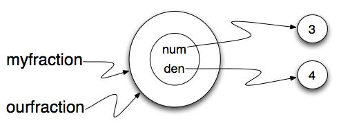

..  Copyright (C)  Brad Miller, David Ranum, Jeffrey Elkner, Peter Wentworth, Allen B. Downey, Chris
    Meyers, and Dario Mitchell.  Permission is granted to copy, distribute
    and/or modify this document under the terms of the GNU Free Documentation
    License, Version 1.3 or any later version published by the Free Software
    Foundation; with Invariant Sections being Forward, Prefaces, and
    Contributor List, no Front-Cover Texts, and no Back-Cover Texts.  A copy of
    the license is included in the section entitled "GNU Free Documentation
    License".

Sameness
--------

The meaning of the word *same* seems perfectly clear until you give it some
thought and then you realize there is more to it than you expected.

For example, if you say, Chris and I have the same car, you mean that his car
and yours are the same make and model, but that they are two different cars. If
you say, Chris and I have the same mother, you mean that his mother and yours
are the same person.

When you talk about objects, there is a similar ambiguity. For example, if two
``Fraction``\ s are the same, does that mean they contain the same data
(same numerator and denominator) or that they are actually the same object?

We've already seen the ``is`` operator in the chapter on lists, where we
talked about aliases.
It allows us to find out if two references refer to the same object.

.. activecode:: fractions_is

    class Fraction:

        def __init__(self, top, bottom):

            self.num = top        # the numerator is on top
            self.den = bottom     # the denominator is on the bottom

        def __str__(self):
            return str(self.num) + "/" + str(self.den)

    myfraction = Fraction(3, 4)
    yourfraction = Fraction(3, 4)
    print(myfraction is yourfraction)

    ourfraction = myfraction
    print(myfraction is ourfraction)

Even though ``myfraction`` and ``yourfraction`` contain the same numerator and denominator, they are not the same object. 

.. image:: Figures/fractionpic2.png

If we assign ``myfraction`` to ``ourfraction``, then the two variables are aliases
of the same object.

This type of equality is called **shallow equality** because it compares only
the references, not the contents of the objects.  Using the == operator to check equality between two user
defined objects
will return the shallow equality result.  In other words, the ``Fraction`` objects are equal (==) if they are the same object.

Of course, we could define equality to mean the fractions are the same in that they have the same numerator and the same
denominator.  For example, here is a boolean function that performs this check.

.. sourcecode:: python

    def sameFraction(f1, f2):
        return (f1.getNum() == f2.getNum()) and (f1.getDen() == f2.getDen())

This type of equality is known as **deep equality** since it compares the values "deep" in the object, not just the reference to the object. 
  
.. activecode:: fractions_eq1

    def sameFraction(f1, f2):
        return (f1.getNum() == f2.getNum()) and (f1.getDen() == f2.getDen())
 
    class Fraction:

        def __init__(self, top, bottom):

            self.num = top        # the numerator is on top
            self.den = bottom     # the denominator is on the bottom

        def __str__(self):
            return str(self.num) + "/" + str(self.den)

        def getNum(self):
            return self.num

        def getDen(self):
            return self.den

    myfraction = Fraction(3, 4)
    yourfraction = Fraction(3, 4)
    print(myfraction is yourfraction)
    print(sameFraction(myfraction, yourfraction))

Of course, if the two variables refer to the same object, they have both
shallow and deep equality.

.. admonition:: Beware of  == 

    "When I use a word," Humpty Dumpty said, in a rather scornful tone, "it means just what I choose it to mean --- neither more nor less."   *Alice in Wonderland*
    
    Python has a powerful feature that allows a designer of a class to decide what an operation
    like ``==`` or ``<`` should mean.  (We've just shown how we can control how our own objects
    are converted to strings, so we've already made a start!)  We'll cover more detail later. 
    But sometimes the implementors will attach shallow equality semantics, and 
    sometimes deep equality, as shown in this little experiment:  
    
    .. sourcecode:: python
    
        p = Point(4, 2)
        s = Point(4, 2)
        print("== on Points returns", p == s)  # by default, == does a shallow equality test here

        a = [2, 3]
        b = [2, 3]
        print("== on lists returns",  a == b)  # by default, == does a deep equality test on lists

    This outputs::
    
        == on Points returns False
        == on lists returns True  
        
    So we conclude that even though the two lists (or tuples, etc.) are distinct objects
    with different memory addresses, in one case the ``==`` operator tests for deep equality, 
    while in the case of points it makes a shallow test. 

