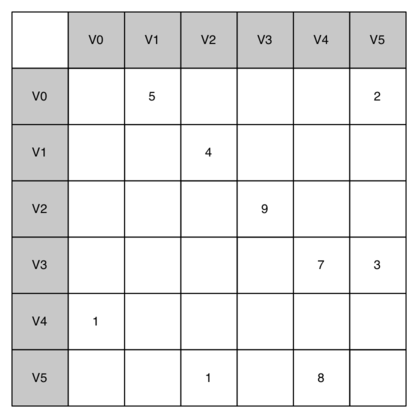

..  Copyright (C)  Brad Miller, David Ranum, Jeffrey Elkner, Peter Wentworth, Allen B. Downey, Chris
    Meyers, and Dario Mitchell.  Permission is granted to copy, distribute
    and/or modify this document under the terms of the GNU Free Documentation
    License, Version 1.3 or any later version published by the Free Software
    Foundation; with Invariant Sections being Forward, Prefaces, and
    Contributor List, no Front-Cover Texts, and no Back-Cover Texts.  A copy of
    the license is included in the section entitled "GNU Free Documentation
    License".

An Adjacency Matrix
~~~~~~~~~~~~~~~~~~~

One of the easiest ways to implement a graph is to use a two-dimensional
matrix. In this matrix implementation, each of the rows and columns
represent a vertex in the graph. The value that is stored in the cell at
the intersection of row :math:`v` and column :math:`w` indicates if
there is an edge from vertex :math:`v` to vertex :math:`w`. When two
vertices are connected by an edge, we say that they are **adjacent**.
:ref:`Figure 3 <fig_adjmat>` illustrates the adjacency matrix for the graph in
:ref:`Figure 2 <fig_dgsimple>`. A value in a cell represents the weight of the
edge from vertex :math:`v` to vertex :math:`w`.

.. _fig_adjmat:

   Figure 3: An Adjacency Matrix Representation for a Graph 

The advantage of the adjacency matrix is that it is simple, and for
small graphs it is easy to see which nodes are connected to other nodes.
However, notice that most of the cells in the matrix are empty. Because
most of the cells are empty we say that this matrix is “sparse.” A
matrix is not a very efficient way to store sparse data. In fact, in
Python you must go out of your way to even create a matrix structure
like the one in :ref:`Figure 3 <fig_adjmat>`.

The adjacency matrix is a good implementation for a graph when the
number of edges is large. But what do we mean by large? How many edges
would be needed to fill the matrix? Since there is one row and one
column for every vertex in the graph, the number of edges required to
fill the matrix is :math:`|V|^2`. A matrix is full when every vertex
is connected to every other vertex. There are few real problems that
approach this sort of connectivity. The problems we will look at in this
chapter all involve graphs that are sparsely connected.

