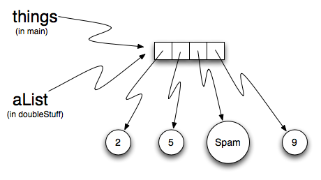

..  Copyright (C)  Brad Miller, David Ranum, Jeffrey Elkner, Peter Wentworth, Allen B. Downey, Chris
    Meyers, and Dario Mitchell.  Permission is granted to copy, distribute
    and/or modify this document under the terms of the GNU Free Documentation
    License, Version 1.3 or any later version published by the Free Software
    Foundation; with Invariant Sections being Forward, Prefaces, and
    Contributor List, no Front-Cover Texts, and no Back-Cover Texts.  A copy of
    the license is included in the section entitled "GNU Free Documentation
    License".
    
..  shortname:: Lists
..  description:: The basic list data type in python
    
.. index:: list, element, sequence, collection    
    
Lists
=====

A **list** is a sequential collection of Python data values, where each value is identified by an
index. The values that make up a list are called its **elements**. Lists are
similar to strings, which are ordered collections of characters, except that the
elements of a list can have any type and for any one list, the items can be of different types.

.. index:: nested list, list; nested

List Values
-----------

There are several ways to create a new list.  The simplest is to enclose the
elements in square brackets ( ``[`` and ``]``).

.. sourcecode:: python
    
    [10, 20, 30, 40]
    ["spam", "bungee", "swallow"]

The first example is a list of four integers. The second is a list of three
strings. As we said above, the elements of a list don't have to be the same type.  The following
list contains a string, a float, an integer, and
another list.

.. sourcecode:: python
    
    ["hello", 2.0, 5, [10, 20]]

A list within another list is said to be **nested** and the inner list is often called a **sublist**.
Finally, there is a special list that contains no elements. It is called the
empty list, and is denoted ``[]``.

As you would expect, we can also assign list values to variables and pass lists as parameters to functions.  

.. activecode:: chp09_01
    
    vocabulary = ["iteration", "selection", "control"]
    numbers = [17, 123]
    empty = []
    mixedlist = ["hello", 2.0, 5*2, [10, 20]]

    print(numbers)
    print(mixedlist)
    newlist = [ numbers, vocabulary ]
    print(newlist)

.. _accessing-elements:

**Check your understanding**

.. mchoicemf:: test_question9_1_1 
   :answer_a: False
   :answer_b: True
   :correct: a
   :feedback_a: Yes, unlike strings, lists can consist of any type of Python data.
   :feedback_b: Lists are heterogeneous, meaning they can have different types of data.

   A list can contain only integer items.

.. index:: list index, index, list traversal

List Length
-----------

As with strings, the function ``len`` returns the length of a list (the number
of items in the list).  However, since lists can have items which are themselves lists, it important to note
that ``len`` only returns the top-most length.  In other words, sublists are considered to be a single
item when counting the length of the list.

.. activecode:: chp09_01a

    alist =  ["hello", 2.0, 5, [10, 20]]
    print(len(alist))
    print(len(['spam!', 1, ['Brie', 'Roquefort', 'Pol le Veq'], [1, 2, 3]]))

**Check your understanding**

.. mchoicemf:: test_question9_2_1 
   :answer_a: 4
   :answer_b: 5
   :correct: b
   :feedback_a: len returns the actual number of items in the list, not the maximum index value.
   :feedback_b: Yes, there are 5 items in this list.

   What is printed by the following statements?
   
   <pre>
   alist = [3, 67, "cat", 3.14, False]
   print(len(alist))
   </pre>
   
.. mchoicemf:: test_question9_2_2
   :answer_a: 7
   :answer_b: 8
   :correct: a
   :feedback_a: Yes, there are 7 items in this list even though two of them happen to also be lists.
   :feedback_b: len returns the number of top level items in the list.  It does not count items in sublists.

   What is printed by the following statements?
   
   <pre>
   alist = [3, 67, "cat", [56, 57, "dog"], [ ], 3.14, False]
   print(len(alist))
   </pre> 
   
Accessing Elements
------------------

The syntax for accessing the elements of a list is the same as the syntax for
accessing the characters of a string.  We use the index operator ( ``[]`` -- not to
be confused with an empty list). The expression inside the brackets specifies
the index. Remember that the indices start at 0.  Any integer expression can be used
as an index and as with strings, negative index values will locate items from the right instead
of from the left.

.. activecode:: chp09_02
    
    numbers = [17, 123, 87, 34, 66, 8398, 44]
    print(numbers[2])
    print(numbers[9-8])
    print(numbers[-2])
    print(numbers[len(numbers)-1])
    
**Check your understanding**
 
.. mchoicemf:: test_question9_3_1
   :answer_a: [ ]
   :answer_b: 3.14
   :answer_c: False
   :correct: b
   :feedback_a: The empty list is at index 4.
   :feedback_b: Yes, 3.14 is at index 5 since we start counting at 0 and sublists count as one item.
   :feedback_c: False is at index 6.
   
   What is printed by the following statements?
   
   <pre>
   alist = [3, 67, "cat", [56, 57, "dog"], [ ], 3.14, False]
   print(alist[5])
   </pre>
   
.. mchoicemf:: test_question9_3_2
   :answer_a: Error, you cannot use the upper method on a list.
   :answer_b: 2
   :answer_c: CAT
   :correct: c
   :feedback_a: alist[2] is the string cat so the upper method is legal
   :feedback_b: 2 is the index.  We want the item at that index.
   :feedback_c: Yes, the string cat is upper cased to become CAT.
   
   What is printed by the following statements?
   
   <pre>
   alist = [3, 67, "cat", [56, 57, "dog"], [ ], 3.14, False]
   print(alist[2].upper())
   </pre>
   
.. mchoicemf:: test_question9_3_3
   :answer_a: 56
   :answer_b: c
   :answer_c: cat
   :answer_d: Error, you cannot have two index values unless you are using slicing.
   :correct: b
   :feedback_a: Indexes start with 0, not 1.
   :feedback_b: Yes, the first character of the string at index 2 is c 
   :feedback_c: cat is the item at index 2 but then we index into it further.
   :feedback_d: Using more than one index is fine.  You read it from left to right.
   
   What is printed by the following statements?
   
   <pre>
   alist = [3, 67, "cat", [56, 57, "dog"], [ ], 3.14, False]
   print(alist[2][0])
   </pre>
   
List Membership
---------------

``in`` and ``not in`` are boolean operators that test membership in a sequence. We
used them previously with strings and they also work here.

.. activecode:: chp09_4
    
    fruit = ["apple","orange","banana","cherry"]

    print("apple" in fruit)
    print("pear" in fruit)

**Check your understanding**

.. mchoicemf:: test_question9_4_1
   :answer_a: True
   :answer_b: False
   :correct: a
   :feedback_a: Yes, 3.14 is an item in the list alist.
   :feedback_b: There are 7 items in the list, 3.14 is one of them. 
   
   What is printed by the following statements?
   
   <pre>
   alist = [3, 67, "cat", [56, 57, "dog"], [ ], 3.14, False]
   print(3.14 in alist)
   </pre>

.. mchoicemf:: test_question9_4_2
   :answer_a: True
   :answer_b: False
   :correct: b
   :feedback_a: in returns True for top level items only.  57 is in a sublist.
   :feedback_b: Yes, 57 is not a top level item in alist.  It is in a sublist.
   
   What is printed by the following statements?
   
   <pre>
   alist = [3, 67, "cat", [56, 57, "dog"], [ ], 3.14, False]
   print(57 in alist)
   </pre>

Concatenation and Repetition
----------------------------

Again, as with strings, the ``+`` operator concatenates lists.  
Similarly, the ``*`` operator repeats the items in a list a given number of times.

.. activecode:: chp09_5

    fruit = ["apple","orange","banana","cherry"]
    print([1,2] + [3,4])
    print(fruit+[6,7,8,9])

    print([0] * 4)
    print([1,2,["hello","goodbye"]]*2)

It is important to see that these operators create new lists from the elements of the operand lists.  If you concatenate a list with 2 items and a list with 4 items, you will get a new list with 6 items (not a list with two sublists).  Similarly, repetition of a list of 2 items 4 times will give a list with 8 items.

One way for us to make this more clear is to run a part of this example in codelens.  As you step thru the code, you will see the variables being created and the lists that they refer to.  Pay particular attention to the `id` tag that is shown after the data type descriptor (``list (id = 12)``).  The **id** in Python corresponds to a unique identifier for that particular object.  You can tell if you have different objects by comparing the ids.

.. codelens:: chp09_concatid

    fruit = ["apple","orange","banana","cherry"]
    numlist = [6,7]

    newlist = fruit + numlist

    zeros = [0] * 4

The statement ``newlist = fruit + numlist`` creates a new list object with the contents of the list ``fruit`` followed by the contents of the list ``numlist``. We can see it is a new list by looking at the ids.  The id of ``newlist`` is not the same as the others.  It is extremely important to know whether you are creating a new list or just modifying an existing list.  Again, the ids can help.

In Python, there is a built-in function that can be called on any object to return its unique id.  The function is appropriately called ``id`` and takes a single parameter, the object that you are interested in knowing about.  You can see in the example below that a real id is usually a very large integer value (corresponding to an address in memory).

.. sourcecode:: python

    >>> alist = [4,5,6]
    >>> id(alist)
    4300840544
    >>> 

**Check your understanding**

.. mchoicemf:: test_question9_5_1
   :answer_a: 6
   :answer_b: [1,2,3,4,5,6]
   :answer_c: [1,3,5,2,4,6]
   :answer_d: [3,7,11]
   :correct: c
   :feedback_a: Concatenation does not add the lengths of the lists.
   :feedback_b: Concatenation does not reorder the items. 
   :feedback_c: Yes, a new list with all the items of the first list followed by all those from the second.
   :feedback_d: Concatenation does not add the individual items.
   
   What is printed by the following statements?
   
   <pre>
   alist = [1,3,5]
   blist = [2,4,6]
   print(alist + blist)
   </pre>
   
   
.. mchoicemf:: test_question9_5_2
   :answer_a: 9
   :answer_b: [1,1,1,3,3,3,5,5,5]
   :answer_c: [1,3,5,1,3,5,1,3,5]
   :answer_d: [3,9,15]
   :correct: c
   :feedback_a: Repetition does not multiply the lengths of the lists.  It repeats the items.
   :feedback_b: Repetition does not repeat each item individually.
   :feedback_c: Yes, the items of the list are repeated 3 times, one after another.
   :feedback_d: Repetition does not multiply the individual items.
   
   What is printed by the following statements?
   
   <pre>
   alist = [1,3,5]
   print(alist * 3)
   </pre>
   

List Slices
-----------

The slice operation we saw with strings also work on lists.  Remember that the first index is the starting point for the slice and the second number is one index past the end of the slice (up to but not including that element).

.. activecode:: chp09_6
    
    a_list = ['a', 'b', 'c', 'd', 'e', 'f']
    print(a_list[1:3])
    print(a_list[:4])
    print(a_list[3:])
    print(a_list[:])

**Check your understanding**

.. mchoicemf:: test_question9_6_1
   :answer_a: [ [ ], 3.14, False]
   :answer_b: [ [ ], 3.14]
   :answer_c: [ [56, 57, "dog"], [ ], 3.14, False]
   :correct: a
   :feedback_a: Yes, the slice starts at index 4 and goes up to and including the last item.
   :feedback_b: By leaving out the upper bound on the slice, we go up to and including the last item.
   :feedback_c: Index values start at 0.
   
   What is printed by the following statements?
   
   <pre>
   alist = [3, 67, "cat", [56, 57, "dog"], [ ], 3.14, False]
   print(alist[4:])
   </pre>

.. index:: mutable, item assignment, immutable
    
Lists are Mutable
-----------------

Unlike strings, lists are **mutable**.  This means we can change an item in a list by accessing
it directly as part of the assignment statement. Using the indexing operator (square brackets) on the left side of an assignment, we can
update one of the list items.

.. activecode:: ch09_7
    
    fruit = ["banana", "apple", "cherry"]
    print(fruit)

    fruit[0] = "pear"
    fruit[-1] = "orange"
    print(fruit)

An
assignment to an element of a list is called **item assignment**. Item
assignment does not work for strings.  Recall that strings are immutable.

Here is the same example in codelens so that you can step thru the statements and see the changes to the list elements.

.. codelens:: item_assign
    
    fruit = ["banana", "apple", "cherry"]

    fruit[0] = "pear"
    fruit[-1] = "orange"

By combining assignment with the slice operator we can update several elements at once.

.. activecode:: ch09_8
    
    alist = ['a', 'b', 'c', 'd', 'e', 'f']
    alist[1:3] = ['x', 'y']
    print(alist)

We can also remove elements from a list by assigning the empty list to them.

.. activecode:: ch09_9
    
    alist = ['a', 'b', 'c', 'd', 'e', 'f']
    alist[1:3] = []
    print(alist)

We can even insert elements into a list by squeezing them into an empty slice at the
desired location.

.. activecode:: ch09_10
    
    alist = ['a', 'd', 'f']
    alist[1:1] = ['b', 'c']
    print(alist)
    alist[4:4] = ['e']
    print(alist)

**Check your understanding**

.. mchoicemf:: test_question9_7_1
   :answer_a: [4,2,True,8,6,5]
   :answer_b: [4,2,True,6,5]
   :answer_c: Error, it is illegal to assign
   :correct: b
   :feedback_a: Item assignment does not insert the new item into the list.
   :feedback_b: Yes, the value True is placed in the list at index 2.  It replaces 8.
   :feedback_c: Item assignment is allowed with lists.  Lists are mutable.
   
   What is printed by the following statements?
   
   <pre>
   alist = [4,2,8,6,5]
   alist[2] = True
   print(alist)
   </pre>

.. index:: del statement, statement; del

List Deletion
-------------

Using slices to delete list elements can be awkward, and therefore error-prone.
Python provides an alternative that is more readable.
The ``del`` statement removes an element from a list by using its position.

.. activecode:: ch09_11
    
    a = ['one', 'two', 'three']
    del a[1]
    print(a)

    alist = ['a', 'b', 'c', 'd', 'e', 'f']
    del alist[1:5]
    print(alist)

As you might expect, ``del`` handles negative indices and causes a runtime
error if the index is out of range.
In addition, you can use a slice as an index for ``del``.
As usual, slices select all the elements up to, but not including, the second
index.

.. index:: is operator, objects and values

Objects and References
----------------------

If we execute these assignment statements,

.. sourcecode:: python
    
    a = "banana"
    b = "banana"

we know that ``a`` and ``b`` will refer to a string with the letters
``"banana"``. But we don't know yet whether they point to the *same* string.

There are two possible ways the Python interpreter could arrange its internal states:

.. image:: Figures/refdiag1.png
   :alt: List illustration 

or

.. image:: Figures/refdiag2.png
   :alt: List illustration

In one case, ``a`` and ``b`` refer to two different string objects that have the same
value. In the second case, they refer to the same object. Remember that an object is something a variable can
refer to.

We already know that objects can be identified using their unique identifier.  We can also test whether two names refer to the same object using the *is*
operator.  The *is* operator will return true if the two references are to the same object.  In other words, the references are the same.  Try our example from above.

.. activecode:: chp09_is1

    a = "banana"
    b = "banana"

    print(a is b)

The answer is ``True``.  This tells us that both ``a`` and ``b`` refer to the same object, and that it
is the second of the two reference diagrams that describes the relationship. 
Since strings are *immutable*, Python optimizes resources by making two names
that refer to the same string value refer to the same object.

This is not the case with lists.  Consider the following example.  Here, ``a`` and ``b`` refer to two different lists, each of which happens to have the same element values.

.. activecode:: chp09_is2
    
    a = [81,82,83]
    b = [81,82,83]

    print(a is b)

    print(a == b)  

The reference diagram for this example looks like this:

.. image:: Figures/refdiag3.png
   :alt: Reference diagram for equal different lists 

``a`` and ``b`` have the same value but do not refer to the same object.

There is one other important thing to notice about this reference diagram.  The variable ``a`` is a reference to a **collection of references**.  Those references actually refer to the integer values in the list.  In other words, a list is a collection of references to objects.  Interestingly, even though ``a`` and ``b`` are two different lists (two different collections of references), the integer object ``81`` is shared by both.  Like strings, integers are also immutable so Python optimizes and lets everyone share the same object.

Here is the example in codelens.  Pay particular attention to the `id` values.

.. codelens:: chp09_istrace
    :showoutput:
    
    a = [81,82,83]
    b = [81,82,83]

    print(a is b)
    print(a == b)

.. index:: aliases

Aliasing
--------

Since variables refer to objects, if we assign one variable to another, both
variables refer to the same object:

.. activecode:: listalias1
    
    a = [81, 82, 83]
    b = a
    print(a is b)
    
In this case, the reference diagram looks like this:

.. image:: Figures/refdiag4.png
   :alt: State snapshot for multiple references (aliases) to a list 

Because the same list has two different names, ``a`` and ``b``, we say that it
is **aliased**. Changes made with one alias affect the other.  In the codelens example below, the `ids` of ``a`` and ``b`` become the same after executing the assignment statement ``b = a``.

.. codelens:: chp09_is3
    :showoutput:
    
    a = [81,82,83]
    b = [81,82,83]

    print(a == b)
    print(a is b)

    b = a
    print(a == b)
    print(a is b)

    b[0] = 5
    print(a)
    

Although this behavior can be useful, it is sometimes unexpected or
undesirable. In general, it is safer to avoid aliasing when you are working
with mutable objects. Of course, for immutable objects, there's no problem.
That's why Python is free to alias strings and integers when it sees an opportunity to
economize.

**Check your understanding**

.. mchoicemf:: test_question9_10_1
   :answer_a: [4,2,8,6,5]
   :answer_b: [4,2,8,999,5]
   :correct: b
   :feedback_a: blist is not a copy of alist, it is a reference to the list alist refers to.
   :feedback_b: Yes, since alist and blist both reference the same list, changes to one also change the other.
   
   What is printed by the following statements?
   
   <pre>
   alist = [4,2,8,6,5]
   blist = alist
   blist[3] = 999
   print(alist)
   </pre>

.. index:: clone

Cloning Lists
-------------

If we want to modify a list and also keep a copy of the original, we need to be
able to make a copy of the list itself, not just the reference. This process is
sometimes called **cloning**, to avoid the ambiguity of the word copy.

The easiest way to clone a list is to use the slice operator.

Taking any slice of ``a`` creates a new list. In this case the slice happens to
consist of the whole list.

.. codelens:: chp09_is4
    :showoutput:
    
    a = [81,82,83]

    b = a[:]       # make a clone using slice
    print(a == b)
    print(a is b)

    b[0] = 5

    print(a)
    print(b)

Now we are free to make changes to ``b`` without worrying about ``a``.  Note also that the `id` of b is different from the ``id`` of a.  It is an entirely different list.

Repetition and References
-------------------------

We have already seen the repetition operator working on strings as well as lists.  For example, 

.. activecode:: repref1

    origlist = [45, 76, 34, 55]
    print(origlist*3)

With a list, the repetition operator creates copies of the references.  Although this may seem simple enough, when we allow a list to refer to another list, a subtle problem can arise.

Consider the following extension on the previous example.

.. activecode:: repref2

    origlist = [45, 76, 34, 55]
    print(origlist*3)

    newlist = [origlist] * 3

    print(newlist)

``newlist`` is a list of three references to ``origlist`` that were created by the repetition operator.  The reference diagram is shown below.

.. image:: Figures/refrep1.png
   :alt: Repetition of a nested list

Now, what happens if we modify a value in ``origlist``.

.. activecode:: repref3

    origlist = [45, 76, 34, 55]

    newlist = [origlist] * 3

    print(newlist)

    origlist[1] = 99

    print(newlist)

``newlist`` shows the change in three places.  This can easily be seen by noting that in the reference diagram, there is only one ``origlist``, so any changes to it appear in all three references from ``newlist``.

.. image:: Figures/refrep2.png
   :alt: Same reference

Here is the same example in codelens.  Step through the code until paying particular attention to the result of executing the assignment statement ``origlist[1] = 99``.

.. codelens:: reprefstep
    :showoutput:

    origlist = [45, 76, 34, 55]

    newlist = [origlist] * 3

    print(newlist)

    origlist[1] = 99

    print(newlist)

**Check your understanding**

.. mchoicemf:: test_question9_12_1
   :answer_a: [4,2,8,999,5,4,2,8,6,5]
   :answer_b: [4,2,8,999,5]
   :answer_c: [4,2,8,6,5]
   :correct: c
   :feedback_a: print(alist) not print(blist)
   :feedback_b: blist is changed, not alist.
   :feedback_c: Yes, alist was unchanged by the assignment statement. blist was a copy of the references in alist.
   
   What is printed by the following statements?
   
   <pre>
   alist = [4,2,8,6,5]
   blist = alist * 2
   blist[3] = 999
   print(alist)
   </pre>

.. mchoicemf:: test_question9_12_2
   :answer_a: [4,2,8,999,5,4,2,8,999,5]
   :answer_b: [[4,2,8,999,5],[4,2,8,999,5]]
   :answer_c: [4,2,8,6,5]
   :answer_d: [[4,2,8,999,5],[4,2,8,6,5]]
   :correct: b
   :feedback_a: [alist] * 2 creates a list containing alist repeated 2 times
   :feedback_b: Yes, blist contains two references, both to alist.
   :feedback_c: print(blist)
   :feedback_d: blist contains two references, both to alist so changes to alist appear both times.
   
   What is printed by the following statements?
   
   <pre>
   alist = [4,2,8,6,5]
   blist = [alist] * 2
   alist[3] = 999
   print(blist)
   </pre>

.. index:: list; append

List Methods
------------

The dot operator can also be used to access built-in methods of list objects.  
``append`` is a list method which adds the argument passed to it to the end of
the list. Continuing with this example, we show several other list methods.  Many of them are
easy to understand.  

.. activecode:: chp09_meth1

    mylist = []
    mylist.append(5)
    mylist.append(27)
    mylist.append(3)
    mylist.append(12)
    print(mylist)

    mylist.insert(1, 12)
    print(mylist)
    print(mylist.count(12))

    print(mylist.index(3))
    print(mylist.count(5))

    mylist.reverse()
    print(mylist)

    mylist.sort()
    print(mylist)

    mylist.remove(5)
    print(mylist)

    lastitem = mylist.pop()
    print(lastitem)
    print(mylist)

There are two ways to use the ``pop`` method.  The first, with no parameter, will remove and return the
last item of the list.  If you provide a parameter for the position, ``pop`` will remove and return the
item at that position.  Either way the list is changed.

The following table provides a summary of the list methods shown above.  Be sure
to experiment with these methods to gain a better understanding of what they do.

==========  ==============  ============  ================================================
Method      Parameters       Result       Description
==========  ==============  ============  ================================================
append      item            mutator       Adds a new item to the end of a list
insert      position, item  mutator       Inserts a new item at the position given
pop         none            hybrid        Removes and returns the last item
pop         position        hybrid        Removes and returns the item at position
sort        none            mutator       Modifies a list to be sorted
reverse     none            mutator       Modifies a list to be in reverse order
index       item            return idx    Returns the position of first occurrence of item
count       item            return ct     Returns the number of occurrences of item
remove      item            mutator       Removes the first occurrence of item
==========  ==============  ============  ================================================

Details for these and others
can be found in the `Python Documentation <http://docs.python.org/py3k/library/stdtypes.html#sequence-types-str-bytes-bytearray-list-tuple-range>`_.

It is important to note that ``append``, ``sort``, 
and ``reverse`` all return ``None``.  This means that re-assigning ``mylist`` to the result of sorting ``mylist`` will result in losing the entire list.

.. activecode:: chp09_meth2

    mylist = []
    mylist.append(5)
    mylist.append(27)
    mylist.append(3)
    mylist.append(12)
    print(mylist)

    mylist = mylist.sort()   #probably an error
    print(mylist)

**Check your understanding**

.. mchoicemf:: test_question9_13_1
   :answer_a: [4,2,8,6,5,False,True]
   :answer_b: [4,2,8,6,5,True,False]
   :answer_c: [True,False,4,2,8,6,5]
   :correct: b
   :feedback_a: True was added first, then False was added last.
   :feedback_b: Yes, each item is added to the end of the list.
   :feedback_c: append adds at the end, not the beginning.
   
   What is printed by the following statements?
   
   <pre>
   alist = [4,2,8,6,5]
   alist.append(True)
   alist.append(False)
   print(alist)
   </pre>

.. mchoicemf:: test_question9_13_2
   :answer_a: [False,4,2,True,8,6,5]
   :answer_b: [4,False,True,2,8,6,5]
   :answer_c: [False,2,True,6,5]
   :correct: a
   :feedback_a: Yes, first True was added at index 2, then False was added at index 0.
   :feedback_b: insert will place items at the index position specified and move everything down to the right.
   :feedback_c: insert does not remove anything or replace anything.
   
   What is printed by the following statements?
   
   <pre>
   alist = [4,2,8,6,5]
   alist.insert(2,True)
   alist.insert(0,False)
   print(alist)
   </pre>

.. mchoicemf:: test_question9_13_3
   :answer_a: [4,8,6]
   :answer_b: [2,6,5]
   :answer_c: [4,2,6]
   :correct: c
   :feedback_a: pop(2) removes the item at index 2, not the 2 itself.
   :feedback_b: pop() removes the last item, not the first.
   :feedback_c: Yes, first the 8 was removed, then the last item, which was 5.
   
   What is printed by the following statements?
   
   <pre>
   alist = [4,2,8,6,5]
   temp = alist.pop(2)
   temp = alist.pop()
   print(alist)
   </pre>
   
   
.. mchoicemf:: test_question9_13_4
   :answer_a: [2,8,6,5]
   :answer_b: [4,2,8,6,5]
   :answer_c: 4
   :answer_d: None
   :correct: c
   :feedback_a: alist is now the value that was returned from pop(0).
   :feedback_b: pop(0) changes the list by removing the first item.
   :feedback_c: Yes, first the 4 was removed from the list, then returned and assigned to alist.  The list is lost.
   :feedback_d: pop(0) returns the first item in the list so alist has now been changed.
   
   What is printed by the following statements?
   
   <pre>
   alist = [4,2,8,6,5]
   alist = alist.pop(0)
   print(alist)
   </pre>

.. admonition:: Scratch Editor

	.. actex:: scratch_9_1

The Return of L-Systems
-----------------------

Lets return the the L-systems we introduced in the previous chapter and
introduce a very interesting new feature that requires the use of lists.

Suppose we have the following grammar::

    X
    X --> F[-X]+X
    F --> FF

This L-system looks very similar to the old L-system except that we've added
one change.  We've added the characters '[' and ']'.  The meaning of these
characters adds a very interesting new dimension to our L-Systems.  The '['
character indicates that we want to save the state of our turtle,
namely its position and its heading so that we can come back to this position
later.  The ']' tells the turtle to warp to the most recently saved position.
The way that we will accomplish this is to use lists.  We can save the
heading and position of the turtle as a list of 3 elements.  ``[heading x
y]``  The first index position in the list holds the heading,
the second index position in the list holds the x coordinate,
and the third index position holds the y coordinate.

Now, if we create an empty list and every time we see a '[' we append the
list that contains ``[heading, x, y]`` we create a history of saved places
the turtle has been where the most recently saved location will always be at
the end of the list.  When we find a ']' in the string we use the pop
function to remove the the most recently appended information.

Lets modify our ``drawLsystem`` function to begin to implement this new
behavior.

.. activecode:: list_lsys1

    import turtle

    def drawLsystem(aTurtle,instructions,angle,distance):
        savedInfoList = []
        for cmd in instructions:
            if cmd == 'F':
                aTurtle.forward(distance)
            elif cmd == 'B':
                aTurtle.backward(distance)
            elif cmd == '+':
                aTurtle.right(angle)
            elif cmd == '-':
                aTurtle.left(angle)
            elif cmd == '[':
                savedInfoList.append([aTurtle.heading(),aTurtle.xcor(),aTurtle.ycor()])
                print(savedInfoList)
            elif cmd == ']':
                newInfo = savedInfoList.pop()
                print(newInfo)
                print(savedInfoList)
            else:
                print('Error:', cmd, 'is an unknown command')

    t = turtle.Turtle()
    inst = "FF[-F[-X]+X]+F[-X]+X"
    drawLsystem(t,inst,60,20)

When we run this example we can see that the picture is not very interesting,
but notice what gets printed out, and how the saved information about the
turtle gets added and removed from the end of the list.  In the next example
we'll make use of the information from the list to save and restore the
turtle's position and heading when needed.  We'll use a longer example here
so you get an idea of what the kind of drawing the L-System can really make.

.. activecode:: list_lsys2

    import turtle

    def drawLsystem(aTurtle,instructions,angle,distance):
        savedInfoList = []
        for cmd in instructions:
            if cmd == 'F':
                aTurtle.forward(distance)
            elif cmd == 'B':
                aTurtle.backward(distance)
            elif cmd == '+':
                aTurtle.right(angle)
            elif cmd == '-':
                aTurtle.left(angle)
            elif cmd == '[':
                savedInfoList.append([aTurtle.heading(),aTurtle.xcor(),aTurtle.ycor()])
                print(savedInfoList)
            elif cmd == ']':
                newInfo = savedInfoList.pop()
                aTurtle.setheading(newInfo[0])
                aTurtle.setposition(newInfo[1],newInfo[2])
            else:
                print('Error:', cmd, 'is an unknown command')

    t = turtle.Turtle()
    inst = "FFFFFFFFFFFFFFFFFFFFFFFFFFFFFFFF[-FFFFFFFFFFFFFFFF[-FFFFFFFF[-FFFF[-FF[-F[-X]+X]+F[-X]+X]+FF[-F[-X]+X]+F[-X]+X]+FFFF[-FF[-F[-X]+X]+F[-X]+X]+FF[-F[-X]+X]+F[-X]+X]+FFFFFFFF[-FFFF[-FF[-F[-X]+X]+F[-X]+X]+FF[-F[-X]+X]+F[-X]+X]+FFFF[-FF[-F[-X]+X]+F[-X]+X]+FF[-F[-X]+X]+F[-X]+X]+FFFFFFFFFFFFFFFF[-FFFFFFFF[-FFFF[-FF[-F[-X]+X]+F[-X]+X]+FF[-F[-X]+X]+F[-X]+X]+FFFF[-FF[-F[-X]+X]+F[-X]+X]+FF[-F[-X]+X]+F[-X]+X]+FFFFFFFF[-FFFF[-FF[-F[-X]+X]+F[-X]+X]+FF[-F[-X]+X]+F[-X]+X]+FFFF[-FF[-F[-X]+X]+F[-X]+X]+FF[-F[-X]+X]+F[-X]+X"
    t.setposition(0,-200)
    t.left(90)
    drawLsystem(t,inst,30,2)

Rather than use the ``inst`` string supplied here, use the code from the string
chapter, and write your own applyRules function to implement this L-system.
This example only uses 6 expansions.  Try it out with a larger number of
expansions.  You may also want to try this example with different values for
the angle and distance parameters.

.. admonition:: Scratch Editor

	.. actex:: scratch_9_2

Append versus Concatenate
-------------------------

The ``append`` method adds a new item to the end of a list.  It is also possible to add a new item to the end of a list by using the concatenation operator.  However, you need to be careful.

Consider the following example.  The original list has 3 integers.  We want to add the word "cat" to the end of the list.

.. codelens:: appcon1

    origlist = [45,32,88]

    origlist.append("cat")

Here we have used ``append`` which simply modifies the list.  In order to use concatenation, we need to write an assignment statement that uses the accumulator pattern::

    origlist = origlist + ["cat"]

Note that the word "cat" needs to be placed in a list since the concatenation operator needs two lists to do its work.

.. codelens:: appcon2

    origlist = [45,32,88]

    origlist = origlist + ["cat"]

It is also important to see that with append, the original list is simply modified.  You can see this by watching the `id` of ``origlist``.  It stays the same before and after the append.

On the other hand, with concatenation, you will see that the `id` of the original list is not the same as the `id` of the result after the assignment statement. Step through both examples very slowly to see this important difference.

**Check you understanding**

.. mchoicemf:: test_question9_15_1
   :answer_a: [4,2,8,6,5,999]
   :answer_b: Error, you cannot concatenate a list with an integer.
   :correct: b
   :feedback_a: You cannot concatenate a list with an integer.
   :feedback_b: Yes, in order to perform concatenation you would need to write alist+[999].  You must have two lists.
   
   What is printed by the following statements?
   
   <pre>
   alist = [4,2,8,6,5]
   alist = alist + 999
   print(alist)
   </pre>

.. index:: for loop, enumerate

.. index:: for loop

Lists and ``for`` loops
-----------------------

It is also possible to perform **list traversal** using iteration by item as well as iteration by index.

.. activecode:: chp09_03a

    fruits = ["apple","orange","banana","cherry"]

    for afruit in fruits:     # by item
        print(afruit)

It almost reads like natural language: For (every) fruit in (the list of) fruits,
print (the name of the) fruit.

We can also use the indices to access the items in an iterative fashion.

.. activecode:: chp09_03b

    fruits = ["apple","orange","banana","cherry"]

    for position in range(len(fruits)):     # by index
        print(fruits[position])

In this example, each time through the loop, the variable ``position`` is used as an index into the
list, printing the ``position``-eth element. Note that we used ``len`` as the upper bound on the range
so that we can iterate correctly no matter how many items are in the list.

Any sequence expression can be used in a ``for`` loop.  For example, the ``range`` function returns a sequence of integers.

.. activecode:: chp09_for3
    
    for number in range(20):
        if number % 3 == 0:
            print(number)

This example prints all the multiples of 3 between 0 and 19.

Since lists are mutable, it is often desirable to traverse a list, modifying
each of its elements as you go. The following code squares all the numbers from ``1`` to
``5`` using iteration by position.

.. activecode:: chp09_for4

    numbers = [1, 2, 3, 4, 5]
    print(numbers)

    for i in range(len(numbers)):
        numbers[i] = numbers[i]**2

    print(numbers)

Take a moment to think about ``range(len(numbers))`` until you understand how
it works. We are interested here in both the *value* and its *index* within the
list, so that we can assign a new value to it.

.. admonition:: Scratch Editor

	.. actex:: scratch_9_3

**Check your understanding**

.. mchoicemf:: test_question9_16_1
   :answer_a: [4,2,8,6,5]
   :answer_b: [4,2,8,6,5,5]
   :answer_c: [9,7,13,11,10]
   :answer_d: Error, you cannot concatenate inside an append.
   :correct: c
   :feedback_a: 5 is added to each item before the append is peformed.
   :feedback_b: There are too many items in this list.  Only 5 append operations are performed.
   :feedback_c: Yes, the for loop processes each item of the list.  5 is added before it is appended to blist.
   :feedback_d: 5 is added to each item before the append is performed.
   
   What is printed by the following statements?
   
   <pre>
   alist = [4,2,8,6,5]
   blist = [ ]
   for item in alist:
      blist.append(item+5)
   print(blist)
   </pre>

.. index:: parameter

Using Lists as Parameters
-------------------------

Functions which take lists as arguments and change them during execution are
called **modifiers** and the changes they make are called **side effects**.
Passing a list as an argument actually passes a reference to the list, not a
copy of the list. Since lists are mutable changes made to the 
elements referenced by the parameter change
the same list that the argument is referencing. 
For example, the function below takes a list as an
argument and multiplies each element in the list by 2:

.. activecode:: chp09_parm1
    
    def doubleStuff(aList):
        """ Overwrite each element in aList with double its value. """
        for position in range(len(aList)):
            aList[position] = 2 * aList[position]

    things = [2, 5, 9]
    print(things)
    doubleStuff(things)
    print(things)
    

The parameter ``aList`` and the variable ``things`` are aliases for the
same object.  

   
Since the list object is shared by two references, there is only one copy.
If a function modifies the elements of a list parameter, the caller sees the change since the change
is occurring to the original.

This can be easily seen in codelens.  Note that after the call to ``doubleStuff``, the `id` of the formal parameter ``aList`` is the same as the `id` of ``things``.

.. codelens:: chp09_parm1_trace
    
    def doubleStuff(aList):
        """ Overwrite each element in aList with double its value. """
        for position in range(len(aList)):
            aList[position] = 2 * aList[position]

    things = [2, 5, 9]

    doubleStuff(things)

.. index:: side effect, modifier

.. _pure-func-mod:

Pure Functions
--------------

A **pure function** does not produce side effects. It communicates with the
calling program only through parameters, which it does not modify, and a return
value. Here is the ``doubleStuff`` function from the previous section written as a pure function.
To use the pure function version of ``double_stuff`` to modify ``things``,
you would assign the return value back to ``things``.

.. activecode:: ch09_mod2
    
    def doubleStuff(a_list):
        """ Return a new list in which contains doubles of the elements in a_list. """
        new_list = []
        for value in a_list:
            new_elem = 2 * value
            new_list.append(new_elem)
        return new_list
    
    things = [2, 5, 9]
    print(things)
    things = doubleStuff(things)
    print(things)

Once again, codelens helps us to see the actual references and objects as they are passed and returned.

.. codelens:: ch09_mod3

    def doubleStuff(a_list):
        """ Return a new list in which contains doubles of the elements in a_list. """
        new_list = []
        for value in a_list:
            new_elem = 2 * value
            new_list.append(new_elem)
        return new_list

    things = [2, 5, 9]
    things = doubleStuff(things)

.. admonition:: Scratch Editor

	.. actex:: scratch_9_4

Which is Better?
----------------

Anything that can be done with modifiers can also be done with pure functions.
In fact, some programming languages only allow pure functions. There is some
evidence that programs that use pure functions are faster to develop and less
error-prone than programs that use modifiers. Nevertheless, modifiers are
convenient at times, and in some cases, functional programs are less efficient.

In general, we recommend that you write pure functions whenever it is
reasonable to do so and resort to modifiers only if there is a compelling
advantage. This approach might be called a *functional programming style*.

Functions that Produce Lists
----------------------------

The pure version of ``doubleStuff`` above made use of an 
important **pattern** for your toolbox. Whenever you need to
write a function that creates and returns a list, the pattern is
usually::

    initialize a result variable to be an empty list
    loop
       create a new element 
       append it to result
    return the result

Let us show another use of this pattern.  Assume you already have a function
``is_prime(x)`` that can test if x is prime.  Now, write a function
to return a list of all prime numbers less than n::

   def primes_upto(n):
       """ Return a list of all prime numbers less than n. """
       result = []
       for i in range(2, n):
           if is_prime(i):
               result.append(i)
       return result

List Comprehensions
-------------------

The previous example creates a list from a sequence of values based on some selection criteria.  An easy way to do this type of processing in Python is to use a **list comprehension**.  List comprehensions are concise ways to create lists.  The general syntax is::

   [<expression> for <item> in <sequence> if  <condition>]

where the if clause is optional.  For example,

.. activecode:: listcomp1

    mylist = [1,2,3,4,5]

    yourlist = [item ** 2 for item in mylist]

    print(yourlist)

The expression describes each element of the list that is being built.  The ``for`` clause iterates thru each item in a sequence.  The items are filtered by the ``if`` clause if there is one.  In the example above, the ``for`` statement lets ``item`` take on all the values in the list ``mylist``.  Each item is then squared before it is added to the list that is being built.  The result is a list of squares of the values in ``mylist``.

To write the ``primes_upto`` function we will use the ``is_prime`` function to filter the sequence of integers coming from the ``range`` function.  In other words, for every integer from 2 up to but not including ``n``, if the integer is prime, keep it in the list.

.. sourcecode:: python

	def primes_upto(n):
	    """ Return a list of all prime numbers less than n using a list comprehension. """

	    result = [num for num in range(2,n) if is_prime(num)]
	    return result

.. admonition:: Scratch Editor

	.. actex:: scratch_9_5

**Check your understanding**

.. mchoicemf:: test_question9_20_1
   :answer_a: [4,2,8,6,5]
   :answer_b: [8,4,16,12,10]
   :answer_c: 10
   :answer_d: [10].
   :correct: d
   :feedback_a: Items from alist are doubled before being placed in blist.
   :feedback_b: Not all the items in alist are to be included in blist.  Look at the if clause.
   :feedback_c: The result needs to be a list.
   :feedback_d: Yes, 5 is the only odd number in alist.  It is doubled before being placed in blist.
   
   What is printed by the following statements?
   
   <pre>
   alist = [4,2,8,6,5]
   blist = [num*2 for num in alist if num%2==1]
   print(blist)
   </pre>

.. index:: nested list, list; nested
       
Nested Lists
------------

A nested list is a list that appears as an element in another list. In this
list, the element with index 3 is a nested list.  
If we print(``nested[3]``), we get ``[10, 20]``. To extract an element from the
nested list, we can proceed in two steps.  First, extract the nested list, then extract the item
of interest.  It is also possible to combine those steps using bracket operators that evaluate from
left to right.

.. activecode:: chp09_nest
    
    nested = ["hello", 2.0, 5, [10, 20]]
    innerlist = nested[3]
    print(innerlist)
    item = innerlist[1]
    print(item)

    print(nested[3][1])

.. index:: matrix

**Check your understanding**

.. mchoicemf:: test_question9_21_1
   :answer_a: 6
   :answer_b: 8
   :answer_c: 888
   :answer_d: 999
   :correct: c
   :feedback_a: 6 is in the wrong list.  alist[1] refers to the second item in alist, namely [888,999].
   :feedback_b: 8 is in the wrong list.  alist[1] refers to the second item in alist, namely [888,999].
   :feedback_c: Yes, alist[0][1][0] is True and alist[1] is the second list, the first item is 888.
   :feedback_d: alist[0][1][0] is False.  Take another look at the if statement.
   
   What is printed by the following statements?
   
   <pre>
   alist = [ [4, [True, False], 6, 8], [888, 999] ]
   if alist[0][1][0]:
      print(alist[1][0])
   else:
      print(alist[1][1])
   </pre>

.. index:: strings and lists, split, join

Strings and Lists
-----------------

Two of the most useful methods on strings involve lists of
strings. The ``split`` method
breaks a string into a list of words.  By
default, any number of whitespace characters is considered a word boundary.

.. activecode:: ch09_split1
    
    song = "The rain in Spain..."
    wds = song.split()
    print(wds)

An optional argument called a **delimiter** can be used to specify which
characters to use as word boundaries. The following example uses the string
``ai`` as the delimiter:

.. activecode:: ch09_split2
    
    song = "The rain in Spain..."
    wds = song.split('ai')
    print(wds)

Notice that the delimiter doesn't appear in the result.

The inverse of the ``split`` method is ``join``.  You choose a
desired **separator** string, (often called the *glue*) 
and join the list with the glue between each of the elements.

.. activecode:: ch09_join

    wds = ["red", "blue", "green"]
    glue = ';'
    s = glue.join(wds)
    print(s)
    print(wds)

    print("***".join(wds))
    print("".join(wds))

The list that you glue together (``wds`` in this example) is not modified.  Also, 
you can use empty glue or multi-character strings as glue.

.. admonition:: Scratch Editor

	.. actex:: scratch_9_6

**Check your understanding**

.. mchoicemf:: test_question9_22_1
   :answer_a: Poe
   :answer_b: EdgarAllanPoe
   :answer_c: EAP
   :answer_d: William Shakespeare
   :correct: c
   :feedback_a: Three characters but not the right ones.  namelist is the list of names.
   :feedback_b: Too many characters in this case.  There should be a single letter from each name.
   :feedback_c: Yes, split creates a list of the three names.  The for loop iterates thru the names and creates a string from the first characters.
   :feedback_d: That does not make any sense.
   
   What is printed by the following statements?
   
   <pre>
   myname = "Edgar Allan Poe"
   namelist = myname.split()
   init = ""
   for aname in namelist:
      init = init + aname[0]
   print(init)
   </pre>

    
``list`` Type Conversion Function
---------------------------------
    
Python has a built-in type conversion function called 
``list`` that tries to turn whatever you give it
into a list.  For example, try the following:

.. activecode:: ch09_list1
    
    xs = list("Crunchy Frog")
    print(xs)

The string "Crunchy Frog" is turned into a list by taking each character in the string and placing it in a list.  In general, any sequence can be turned into a list using this function.  The result will be a list containing the elements in the original sequence.  It is not legal to use the ``list`` conversion function on any argument that is not a sequence.

It is also important to point out that the ``list`` conversion function will place each element of the original sequence in the new list.  When working with strings, this is very different than the result of the ``split`` method.  Whereas ``split`` will break a string into a list of "words", ``list`` will always break it into a list of characters.
    
Tuples and Mutability
---------------------

So far you have seen two types of sequential collections: strings, which are made up of
characters; and lists, which are made up of elements of any type.  One of the
differences we noted is that the elements of a list can be modified, but the
characters in a string cannot. In other words, strings are **immutable** and
lists are **mutable**.

A **tuple**, like a list, is a sequence of items of any type. Unlike lists,
however, tuples are immutable. Syntactically, a tuple is a comma-separated
sequence of values.  Although it is not necessary, it is conventional to 
enclose tuples in parentheses:

.. sourcecode:: python

    julia = ("Julia", "Roberts", 1967, "Duplicity", 2009, "Actress", "Atlanta, Georgia")

Tuples are useful for representing what other languages often call *records* ---
some related information that belongs together, like your student record.  There is
no description of what each of these *fields* means, but we can guess.  A tuple
lets us "chunk" together related information and use it as a single thing.

Tuples support the same sequence operations as strings and
lists. 
For example, the index operator selects an element from a tuple.

As with strings, if we try to use item assignment to modify one of the elements of the
tuple, we get an error.

.. sourcecode:: python

    julia[0] = 'X'
    TypeError: 'tuple' object does not support item assignment

Of course, even if we can't modify the elements of a tuple, we can make a variable
reference a new tuple holding different information.  To construct the new tuple,
it is convenient that we can slice parts of the old tuple and join up the
bits to make the new tuple.  So ``julia`` has a new recent film, and we might want
to change her tuple.  We can easily slice off the parts we want and concatenate them with
the new tuple.

.. activecode:: ch09_tuple1

    julia = ("Julia", "Roberts", 1967, "Duplicity", 2009, "Actress", "Atlanta, Georgia")
    print(julia[2])
    print(julia[2:6])

    print(len(julia))

    julia = julia[:3] + ("Eat Pray Love", 2010) + julia[5:]
    print(julia)

To create a tuple with a single element (but you're probably not likely
to do that too often), we have to include the final comma, because without
the final comma, Python treats the ``(5)`` below as an integer in parentheses:

.. activecode:: chp09_tuple2

    tup = (5,)
    print(type(tup))

    x = (5)
    print(type(x))
 

.. index::
    single: assignment; tuple 
    single: tuple; assignment  

Tuple Assignment
----------------

Python has a very powerful **tuple assignment** feature that allows a tuple of variables 
on the left of an assignment to be assigned values from a tuple
on the right of the assignment.

.. sourcecode:: python

    (name, surname, birth_year, movie, movie_year, profession, birth_place) = julia

This does the equivalent of seven assignment statements, all on one easy line.  
One requirement is that the number of variables on the left must match the number
of elements in the tuple. 

Once in a while, it is useful to swap the values of two variables.  With
conventional assignment statements, we have to use a temporary variable. For
example, to swap ``a`` and ``b``:

.. sourcecode:: python

    temp = a
    a = b
    b = temp

Tuple assignment solves this problem neatly:

.. sourcecode:: python

    (a, b) = (b, a)

The left side is a tuple of variables; the right side is a tuple of values.
Each value is assigned to its respective variable. All the expressions on the
right side are evaluated before any of the assignments. This feature makes
tuple assignment quite versatile.

Naturally, the number of variables on the left and the number of values on the
right have to be the same.

.. sourcecode:: python

    >>> (a, b, c, d) = (1, 2, 3)
    ValueError: need more than 3 values to unpack 

.. index::
    single: tuple; return value 

Tuples as Return Values
-----------------------

Functions can return tuples as return values. This is very useful --- we often want to
know some batsman's highest and lowest score, or we want to find the mean and the standard 
deviation, or we want to know the year, the month, and the day, or if we're doing some
some ecological modeling we may want to know the number of rabbits and the number
of wolves on an island at a given time.  In each case, a function (which 
can only return a single value), can create a single tuple holding multiple elements. 

For example, we could write a function that returns both the area and the circumference
of a circle of radius r.

.. activecode:: chp09_tuple3

    
    def circleInfo(r):
        """ Return (circumference, area) of a circle of radius r """
        c = 2 * 3.14159 * r
        a = 3.14159 * r * r
        return (c, a)

    print(circleInfo(10))

.. admonition:: Scratch Editor

	.. actex:: scratch_9_7

Glossary
--------

.. glossary::

    aliases
        Multiple variables that contain references to the same object.

    clone
        To create a new object that has the same value as an existing object.
        Copying a reference to an object creates an alias but doesn't clone the
        object.

    delimiter
        A character or string used to indicate where a string should be split.

    element
        One of the values in a list (or other sequence). The bracket operator
        selects elements of a list.

    index
        An integer variable or value that indicates an element of a list.

    list
        A collection of objects, where each object is identified by an index.
        Like other types ``str``, ``int``, ``float``, etc. there is also a
        ``list`` type-converter function that tries to turn its argument into a 
        list. 

    list traversal
        The sequential accessing of each element in a list.

    modifier
        A function which changes its arguments inside the function body. Only
        mutable types can be changed by modifiers.
        
    mutable data type
        A data type in which the elements can be modified. All mutable types
        are compound types. Lists are mutable data types; strings are not.

    nested list
        A list that is an element of another list.

    object
        A thing to which a variable can refer.
        
    pattern
        A sequence of statements, or a style of coding something that has
        general applicability in a number of different situations.  Part of
        becoming a mature Computer Scientist is to learn and establish the
        patterns and algorithms that form your toolkit.  Patterns often 
        correspond to your "mental chunking".   

    pure function
        A function which has no side effects. Pure functions only make changes
        to the calling program through their return values.

    sequence
        Any of the data types that consist of an ordered collection of elements, with
        each element identified by an index.
        
    side effect
        A change in the state of a program made by calling a function that is
        not a result of reading the return value from the function. Side
        effects can only be produced by modifiers.

Exercises
---------

   
#. Draw a reference diagram for ``a`` and ``b`` before and after the third line of
   the following python code is executed:

   .. sourcecode:: python
    
       a = [1, 2, 3]
       b = a[:]
       b[0] = 5

#.  Create a list called ``myList`` with the following six items: 76, 92.3, "hello", True, 4, 76.

    .. actex:: ex_9_2

 
#.  Write Python statements to do the following:

    a. Append "apple" and 76 to the list.
    #. Insert the value "cat" at position 3.
    #. Insert the value 99 at the start of the list.
    #. Find the index of "hello".
    #. Count the number of 76s in the list.
    #. Remove the first occurrence of 76 from the list.
    #. Remove True from the list using ``pop`` and ``index``.

    .. actex:: ex_9_3

#.  Create a list containing 100 random integers between 0 and 1000 (use iteration, append, and the random module).  Write a function called ``average`` that will take the list as a parameter and return the average.

    .. actex:: ex_9_4

#. Write a Python function that will take a the list of integers from the previous problem and return the maximum value.  (Note: there is a builtin function named ``max`` but pretend you cannot use it.)

    .. actex:: ex_9_5

#. Write a function ``sum_of_squares(xs)`` that computes the sum
   of the squares of the numbers in the list ``xs``.  For example,
   ``sum_of_squares([2, 3, 4])`` should return 4+9+16 which is 29:

    .. actex:: ex_7_11

#. Write a function to count how many odd numbers are in a list.

    .. actex:: ex_9_6

#. Sum up all the even numbers in a list.

    .. actex:: ex_9_7

#. Sum up all the negative numbers in a list.

    .. actex:: ex_9_8

#. Count how many words in a list have length 5.

    .. actex:: ex_9_9

#. Sum all the elements in a list up to but not including the first even number.

    .. actex:: ex_9_10

#. Count how many words occur in a list up to and including the first occurrence of the word "sam".

    .. actex:: ex_9_11

#. Although Python provides us with many list methods, it is good practice and very instructive to think about how they are implemented.  Implement a Python function that works like the following:

    a. count
    #. in
    #. reverse
    #. index
    #. insert

   
    .. actex:: ex_9_12

#. Write a function ``replace(s, old, new)`` that replaces all occurences of
   ``old`` with ``new`` in a string ``s``::

      test(replace('Mississippi', 'i', 'I'), 'MIssIssIppI')
      
      s = 'I love spom!  Spom is my favorite food.  Spom, spom, spom, yum!'
      test(replace(s, 'om', 'am'),
             'I love spam!  Spam is my favorite food.  Spam, spam, spam, yum!')
    
      test(replace(s, 'o', 'a'),
             'I lave spam!  Spam is my favarite faad.  Spam, spam, spam, yum!')

   *Hint*: use the ``split`` and ``join`` methods.

    .. actex:: ex_9_13

#. Here are the rules for an L-system that creates something that resembles
   a common garden herb.  Implement the following rules and try it.  Use an
   angle of 25.7 degrees.::

       H
       H --> HFX[+H][-H]
       X --> X[-FFF][+FFF]FX

   .. actex:: ex_9_14

#. Here is another L-System.  Use an Angle of 25::

       F
       F --> F[-F]F[+F]F

   .. actex:: ex_9_15

