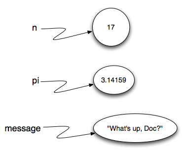

..  Copyright (C)  Brad Miller, David Ranum, Jeffrey Elkner, Peter Wentworth, Allen B. Downey, Chris
    Meyers, and Dario Mitchell.  Permission is granted to copy, distribute
    and/or modify this document under the terms of the GNU Free Documentation
    License, Version 1.3 or any later version published by the Free Software
    Foundation; with Invariant Sections being Forward, Prefaces, and
    Contributor List, no Front-Cover Texts, and no Back-Cover Texts.  A copy of
    the license is included in the section entitled "GNU Free Documentation
    License".

Variables
---------

.. video:: assignvid
    :controls:
    :thumb: ../_static/assignment.png

    http://media.interactivepython.org/thinkcsVideos/Variables.mov
    http://media.interactivepython.org/thinkcsVideos/Variables.webm

One of the most powerful features of a programming language is the ability to
manipulate **variables**. A variable is a name that refers to a value.

**Assignment statements** create new variables and also give them values to refer to.

.. sourcecode:: python

    message = "What's up, Doc?"
    n = 17
    pi = 3.14159

This example makes three assignments. The first assigns the string value
``"What's up, Doc?"`` to a new variable named ``message``. The second gives the
integer ``17`` to ``n``, and the third assigns the floating-point number
``3.14159`` to a variable called ``pi``.

The **assignment token**, ``=``, should not be confused with *equality* (we will see later that equality uses the
``==`` token).  The assignment statement links a *name*, on the left hand
side of the operator, with a *value*, on the right hand side.  This is why you
will get an error if you enter:

.. sourcecode:: python

    17 = n

.. tip::

   When reading or writing code, say to yourself "n is assigned 17" or "n gets
   the value 17" or "n is a reference to the object 17" or "n refers to the object 17".  Don't say "n equals 17".

A common way to represent variables on paper is to write the name with an arrow
pointing to the variable's value. This kind of figure, known as a **reference diagram**, is often called a **state
snapshot** because it shows what state each of the variables is in at a
particular instant in time.  (Think of it as the variable's state of mind).
This diagram shows the result of executing the assignment statements shown above.

If you ask Python to evaluate a variable, it will produce the value
that is currently linked to the variable.  In other words, evaluating a variable will give you the value that is referred to
by the variable.

.. activecode:: ch02_9
    :nocanvas:

    message = "What's up, Doc?"
    n = 17
    pi = 3.14159

    print(message)
    print(n)
    print(pi)

In each case the result is the value of the variable.
To see this in even more detail, we can run the program using codelens.

.. codelens:: ch02_9_codelens
    :showoutput:

    message = "What's up, Doc?"
    n = 17
    pi = 3.14159

    print(message)
    print(n)
    print(pi)

Now, as you step through the statements, you can see
the variables and the values they reference as those references are
created.

Variables also have
types; again, we can ask the interpreter what they are.

.. activecode:: ch02_10
    :nocanvas:

    message = "What's up, Doc?"
    n = 17
    pi = 3.14159

    print(type(message))
    print(type(n))
    print(type(pi))

The type of a variable is the type of the object it currently refers to.

We use variables in a program to "remember" things, like the current score at
the football game.  But variables are *variable*. This means they can change
over time, just like the scoreboard at a football game.  You can assign a value
to a variable, and later assign a different value to the same variable.

.. note::

    This is different from math. In math, if you give `x` the value 3, it
    cannot change to refer to a different value half-way through your
    calculations!

To see this, read and then run the following program.
You'll notice we change the value of `day` three times, and on the third
assignment we even give it a value that is of a different type.

.. codelens:: ch02_11
    :showoutput:

    day = "Thursday"
    print(day)
    day = "Friday"
    print(day)
    day = 21
    print(day)

A great deal of programming is about having the computer remember things.  For example, we might want to keep
track of the number of missed calls on your phone.  Each time another call is missed, we will arrange to update
or change the variable so that it will always reflect the correct value.

**Check your understanding**

.. mchoicemf:: test_question2_3_2
   :answer_a: Nothing is printed. A runtime error occurs.
   :answer_b: Thursday
   :answer_c: 32.5
   :answer_d: 19
   :correct: d
   :feedback_a: It is legal to change the type of data that a variable holds in Python.
   :feedback_b: This is the first value assigned to the variable day, but the next statements reassign that variable to new values.
   :feedback_c: This is the second value assigned to the variable day, but the next statement reassigns that variable to a new value.
   :feedback_d: The variable day will contain the last value assigned to it when it is printed.

   What is printed when the following statements execute?

   .. code-block:: python

     day = "Thursday"
     day = 32.5
     day = 19
     print(day)

.. index:: keyword, underscore character

