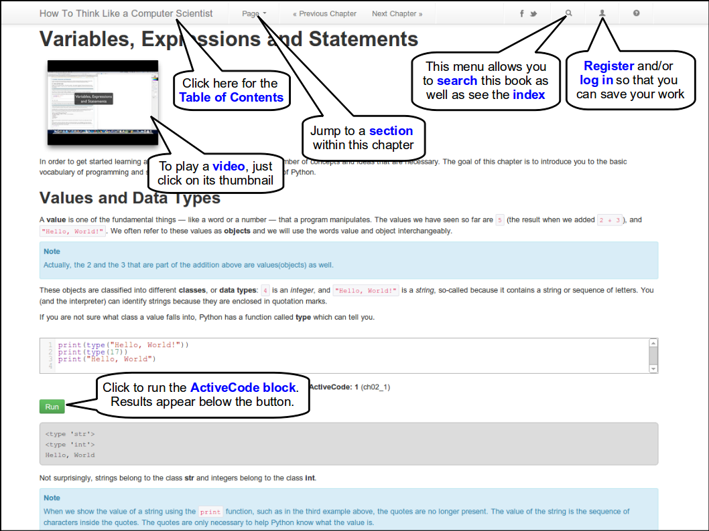

.. _quick_help:

Getting Around The Book
=======================

This diagram gives you a few quick hints on how to get around the textbook.

Activecode
----------
If you have any problems with an activecode example.  The first thing to try is to simply refresh the page.  if you have made changes the code, you will want to copy your changes to the clipboard and then paste them in after the refresh.

If you think you have found a real bug in the book, or if something is incorrect, click on the Report a Problem link.

Registering/Logging In
----------------------

Most of the features of this book are designed to work offline. Feel free to take the book with you on the airplane.  However, if you are online and want to be able to save your work, you can register a username and email on our registration page.  This will let you save your homework, and changes to any of the activecode examples.

Getting More Help
-----------------

If you have any other questions or comments the best place to ask for help is on the `Runestone Interactive <https://groups.google.com/forum/#!forum/runestoneinteractive>`_ google group.  We monitor this group and will do our best to respond quickly to your questions.
