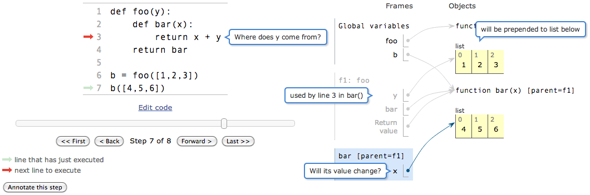

# Project Ideas

This (messy!) document provides an overview of some project ideas for extending
Online Python Tutor (thereafter abbreviated as OPT). View it online at:

https://github.com/pgbovine/OnlinePythonTutor/blob/master/v3/docs/project-ideas.md

Email philip@pgbovine.net if you're interested in working on anything here, or if you have other
project ideas.

## Stylistic

### Beautiful print-outs of OPT visualizations

A lot of instructors want to print out their OPT visualizations to make handouts or lecture notes
for students.
However, the default CSS is optimized for on-screen viewing and not for printing,
so when you try to print the diagrams, they look ugly and unreadable.

The project involves creating a custom CSS optimized for printing, especially on black-and-white printers.
Here is an example how-to guide to get started creating a CSS print style sheet ...
http://coding.smashingmagazine.com/2011/11/24/how-to-set-up-a-print-style-sheet/

Another idea is to get OPT to output SVG, PDF, or another
printer-friendly format.

### Responsive web design for OPT UI

This is a good project for someone interested in visual and web design.

Implement the principles of [responsive web design](http://en.wikipedia.org/wiki/Responsive_Web_Design)
so that OPT visualizations (and the surrounding user interface) look good on displays of many different sizes
ranging from smartphones to tablets to laptops to giant desktop monitors.

## Frontend

### Rich user input widgets

Right now Online Python Tutor takes only code as input. However, it would be great to create widgets that allow
the user to input data into their code. That way, they can visualize the same code executing on different data
without changing the code. Currently, the only way to do this is to
"hard-code" the input data as global constants, which is cumbersome.

Here are some examples of input widgets:

- Text input widget to simulate stdin. This could be used with raw_input()/input()

- Interactive widget to draw mathematical graphs (e.g., nodes and edges); useful for visualizing graph/tree manipulation algorithms
- A 2-D canvas where the user can draw points and lines in a coordinate system; useful for visualizing simple computational geometry algorithms
- A 2-D matrix of numbers or colored blocks for, say, a PacMan world
- Drag and drop an image; useful for visualizing image manipulation algorithms
- A text box that represents a file on the filesystem. Imagine a web-based I/O simulator where there would be a text box simulating a file object, and then I/O calls such as open, readline, etc. would be intercepted and visualized as iterating (pointing) to the file object one line at a time, reading each line into a string, etc. Writing into a file can also be visualized in this way too. And seeking, overwriting, appending, etc.

### Custom data structure visualizations

Right now Online Python Tutor can render only basic Python data structures.

While this is sufficient for teaching introductory CS courses, intermediate and advanced CS students must learn
algorithms involving more sophisticated data structures such as binary trees and graphs.
The goal of this project is to create a set of effective custom renderers for data structures
such as:

- trees
- graphs
- numerical matrices
- simple 2D graphical worlds (e.g., for Pac-Man or Conway’s Game of Life)
- rendering lists of numbers as bar/line graphs, charts, and other quantitative data visualizations (e.g., using Google Charts API)
- file objects
- DSL components such as logic gates for a logic simulator written in Python, or proof trees for formal logic courses
- compiler data structures such as parser states, parse tables, AST construction, code generators, etc.
- relational algebra diagrams for database courses

These renderers will make Online Python Tutor useful in a far larger variety of CS courses and online textbooks
beyond CS0/CS1 sorts of intro classes.

One ultimate goal is to make OPT capable of visualizing classic AI, algorithm, and compiler textbook algorithms
that otherwise would need to be tediously built as one-off special-case visualizations.

From an email excerpt in May 2013: {
I recently added a feature to Online Python Tutor (OPT) that enables user programs to output HTML/CSS/JS, in addition to printing to stdout. Thus, if a program calls html_output(" ... "), when OPT steps over that line, it will render the HTML string in a div. This makes it possible to generate a wide array of visualizations in pure Python (by simply constructing strings that represent legal HTML/CSS/JS).

For the file I/O example, I can imagine creating a special File class that implements "file-like" stream I/O methods. Then the user program might look like:

    import VisualFile
    f = VisualFile(<string contents of the file>)
    for line in open(f):
        <parse line>

The class definition of VisualFile includes the proper HTML-generation code to render a pretty HTML representation of the file's contents. And when methods iterate over the file, it can render an HTML representation with certain lines or characters highlighted to represent, say, the current file pointer position, etc.
}

There are (at least) two main ways to implement this feature:

- Add custom data types to the trace and have the frontend render them
  specially using JS visualization libraries such as d3.

- Take advantage of OPT's (still-undocumented) ability to print
  arbitrary HTML/CSS/JS to the canvas (just like how it can print stdout
  output to a text box). This enables us to create custom data structure classes
  with printHTML() methods that print their graphical representation to
  the web page canvas. The dream here is to be able to write pure-Python modules for
  each custom data type, which can "pretty-print" as HTML/CSS/JS.

### Custom rendering API and plugin system

Right now Online Python Tutor renders Python data structures in a single, fixed way.
However, different instructors have different preferences for how they want certain objects to render
on-screen (and argue passionately for their specific tastes).
There is currently no way for them to specify these custom rendering schemes without mucking around with
intricate JavaScript code in the frontend.

The goal of this project is to create a clean API and plugin architecture so that JavaScript-savvy instructors
can easily create custom renderers.

The ultimate goal here is to completely replace one-off custom algorithm visualizations, whiteboard doodles,
and ad-hoc PowerPoint slide deck animations of CS concepts.

### Annotations for simplifying visualizations

Right now OPT visualizes "everything" about program execution. However, that can easily lead to visual overload.
Let's think about implementing annotations to selectively show/hide different parts of execution, so that instructors
and students can hone in on what they find interesting. Examples:

- annotate functions to trace/skip
- annotate data structures (or parts) to show/hide
- selectively expand or collapse data structure visualizations, which is useful for giant structures
- line-based breakpoints (currently implemented as a hack by puttin `# break` at the end of a line)
- conditional breakpoints

Implementing annotations as ordinary code comments (rather than using a specialized UI) is elegant
because the instructor's code examples are self-contained in plain text and easily archivable outside of OPT.

As a concrete use case, think about how to "clean up" the display of object-oriented programs.
Right now OPT naively visualizes all the steps that the Python interpreter takes when executing an
object-oriented program, which leads to all sorts of extraneous variables, frames, and pointers
lying around.

<a href="http://pythontutor.com/visualize.html#code=%23+Inheritance+-+object-oriented+programming+intro%0A%23+Adapted+from+MIT+6.01+course+notes+(Section+3.5)%0A%23+http%3A//mit.edu/6.01/mercurial/spring10/www/handouts/readings.pdf%0A%0Aclass+Staff601%3A%0A++++course+%3D+'6.01'%0A++++building+%3D+34%0A++++room+%3D+501%0A%0A++++def+giveRaise(self,+percentage)%3A%0A++++++++self.salary+%3D+self.salary+%2B+self.salary+*+percentage%0A%0Aclass+Prof601(Staff601)%3A%0A++++salary+%3D+100000%0A%0A++++def+__init__(self,+name,+age)%3A%0A++++++++self.name+%3D+name%0A++++++++self.giveRaise((age+-+18)+*+0.03)%0A%0A++++def+salutation(self)%3A%0A++++++++return+self.role+%2B+'+'+%2B+self.name%0A%0Apat+%3D+Prof601('Pat',+60)&mode=display&cumulative=false&py=2&curInstr=16">Click here for an example.</a>

Think about how annotations can "clean up" such a big and hairy visualization.

### Semantic zooming and other visual customizations

Right now OPT has only a limited number of ways to display visualizations, mostly set at the time
the "Visualize Execution" button is pressed.

First, push some of the relevant options back to the visualizer UI itself, so they can be toggled
on a live visualization.

Next, think about "semantic zooming" -- i.e., displaying different levels of granularity and focus
targeted toward different user audiences. For instance, fully expanding all the data structures
up-front might overwhelm beginners, so maybe start with them collapsed and then allow the user
to zoom in to expand them. Or maybe even "zooming out" to the point where data structures are
just rendered as plain-text (e.g., a list as `[1, 2, ..., 100]`, to take the focus off the heap details).

Semantic zooming will help improve the "visual scalability" of the visualizations.

### Web-based authoring environment

With a proper Web-based authoring environment, teachers and students can use
Online Python Tutor visualizations as the basis for annotated examples,
programming exercises, and quizzes.

As a start, I've implemented a prototype of "annotation bubbles" for fine-grained annotation of visualization elements:

[Try a mock-up here!](http://pythontutor.com/commentary-bubbles-demo.html)

**Annotated code visualizations**:

- Teachers could use it as a place to put their code examples and mini-lessons (so that they’re persistent, rather than sending out a bunch of gross URLs)
  - Lesson text can be fine-grained -- e.g., specific text to accompany each execution point, or annotations atop individual objects.
    - see the above screenshot for "annotation bubbles" prototype to label individual visualization elements
  - Think about what asides or remarks would a teacher/mentor SAY OUT LOUD when stepping through code with a student/mentee. Those are probably the kinds of commentary that you'd want to put inside of visualizations.
- Students could use it as a Stackoverflow-like forum for asking questions
  - Potentially powerful use case in MOOCs where students can directly annotate visualizations while debugging and then fire off a question to a discussion forum (with all required context). Again, OPT will be embedded within a larger MOOC courseware environment and be a segue into discussion forums.
  - With a lightweight authoring environment, OPT can be used for embedding read-write visualizations. When a student is viewing code visualizations embedded within a textbook or lesson, they can mark annotations for parts they don’t understand and then send off the link to the course staff or discussion forum. So in essence, they’re interacting with the visualization rather than just passively consuming it.

**Exercises/quizzes**: Since we have rich visualizations and interactivity at our disposal,
we can come up with new forms of exercises that are more engaging than simply
"write a function that does X and then passes these 10 unit tests."
For example, one could imagine putting in blank slots as the user steps through the visualization,
and the user would need to fill in those slots with the appropriate values. (There is already a
not-yet-documented prototype of these sorts of pop-up questions, done by Brad Miller.)

### Visualizing orders of growth

Think about how to convey orders of growth of algorithms across data sets of varying sizes.

Notes from Peter N.: {
Peter suggested augmenting special data structure classes with callback hooks to the visualizer (like __str__ on steroids). This allows the visualizer to gracefully skip steps of the yucky internals of a data structure while just stepping through the significant parts. You can imagine instrumenting an Array class and visualizing compares, swaps, etc. for sorting algorithms.

"Third, it would also be great to have a plot API, to plot the runtimes (or some other stat) as a function of input size N."

"Fourth, while I have seen other algorithm systems where they annotate the code (by putting in annotations that say @step or something), I think we can get away without it.  For example, if the problem is sorting a list of integers, don't annotate the algorithm: just pass it an input that consists not of a list of ints, but rather an annotaed list of annotated ints.  An annotated lists increments a counter for every __getitem__ and __setitem__, and an annotated int increments a counter for every __lt__ and the like.  It won't survive malicious attacks, but it will work for all but the actively uncooperative users."

We also talked about visualizing orders of growth of code, such as loops, nested loops, etc. by visualizing how many times things execute and then how that changes as your input size changes.
}

## Backend

### Shared visualization sessions

My main high-level vision for where to take the shared editing is the following:

1. The instructor tells students to join a shared session.
2. The instructor starts "driving" and typing code in the shared session. students watch along.
3. At any time, a student can click a "detach" button and detach his/her session from the teacher. Then the session acts just like regular Online Python Tutor.
4. At any time, a student can "reattach" to the shared session and follow the instructor again.

The basic idea here is that students can follow along with an instructor but then "detach" at anytime to try out their own variations and experiments without interfering with other people's sessions.

A related point/question is: what happens if two people try to simultaneously edit? i assume that they clobber each other's changes, right? in that case, it might be good to designate only ONE person who can edit, and everyone else just watches. or else a mischievous student can just delete everyone's code. of course, you can also have another "free-for-all" mode where everyone can edit.

Another take on this idea:
Adding real-time concurrent editing to these visualizations enables students to work together and tutor
one another while physically separated. A shared workspace can also be useful during both physical and
virtual lectures: As the instructor is lecturing using code visualizations, students can follow along by
viewing those same running examples on their laptops. At any point when curious or confused, students can
instantly diverge from the live example and try out their own variants
on-the-fly in private; they can then sync back to the "live feed" at any time. Students can also text
chat with one another about the lecture, all within the context of the live lecture materials. If students
opt-in to allowing the instructor to access such interaction data, then that could "close the loop" and
help the instructor improve future lectures. For instance, if 80% of students are silently diverging from
the live example at a certain point in lecture, then perhaps that part requires further clarification.

### Visualizing different programming languages (especially JavaScript!)

This project is great for someone who likes to hack on language implementations and runtimes.

The OPT frontend can visualize programs written in any mainstream language, not just Python.
This project involves creating a backend for another language (e.g., Ruby, Java, JavaScript, C, C++, Scheme).
All the backend needs to do is to generate an execution trace in the following format:

https://github.com/pgbovine/OnlinePythonTutor/blob/master/v3/docs/opt-trace-format.md

And the OPT frontend should be able to visualize it!

In particular, I think a **JavaScript backend** would be amazing.
By hacking the [narcissus](https://github.com/mozilla/narcissus) meta-circular JavaScript interpreter,
you should be able to implement a JavaScript visualizer purely in the browser. You get the benefits of
low latency, offline access, and no security concerns that plague traditional server-side apps. How cool is that?!?

Check out backends that other people have already written:

- [Online Java Tutor](http://cscircles.cemc.uwaterloo.ca/java_visualize/) by David Pritchard
- [Online Ruby Tutor](http://www.onlinerubytutor.com/) by Daniel Stutzman
- [Blockly + OPT](http://epleweb.appspot.com/) by Pier Giuliano Nioi

Other misc. implementation notes:

- The [Chicory Java trace generator for Daikon](http://groups.csail.mit.edu/pag/daikon/download/doc/daikon_manual_html/daikon_7.html#SEC69)
might be a good basis for writing a Java backend for OPT. Or take a look at [jdb](http://docs.oracle.com/javase/1.3/docs/tooldocs/solaris/jdb.html), which
should be similar to how Online Python Tutor uses Python's pdb module to generate traces.

- My [master's thesis](http://pgbovine.net/projects/pubs/guo-mixedlevel-mengthesis.pdf) from 2006
describes one possible technique for building a C-language backend based upon the [Valgrind](http://www.valgrind.org)
tool. More importantly, it describes the difficulties involved in creating a robust execution
trace generator for C and C++.
It should be much easier to build a backend for a memory- and type-safe language, though :)

### Skulpt (Python-in-JavaScript) backend

This project is appropriate for someone with advanced knowledge of hacking a Python interpreter
who is willing to make a substantive time commitment.

Right now the OPT backend runs Python code on the server, but it would be super-cool to create a "backend"
that runs entirely in the browser. Modifying Skulpt -- http://www.skulpt.org/ -- is the leading contender here,
since I am in touch with its main developers.

The basic idea is to use Skulpt to generate a JavaScript trace object (all within the web browser without
a server call) and then construct a new ExecutionVisualizer with that trace object as a parameter.
Read "Direct embedding" and the associated code for more detailed info:
https://github.com/pgbovine/OnlinePythonTutor/blob/master/v3/docs/embedding-HOWTO.md#direct-embedding

Main Advantages:
  - Enables fine-grained tracing of expression and sub-expression evaluation, which has clear pedagogical benefits; right now OPT can only single-step over one line at a time since it relies on the Python bdb debugger.
  - Enables an interactive REPL that incrementally takes in user inputs rather than just executing batch programs; this can lead to better interactivity and responsiveness.
  - Supports on-demand evaluation and in-memory storage of (relatively) large data structures such as a 100,000-element dictionary for a spell checker program; right now OPT must send that giant dictionary in a trace (encoded in an inefficient format).
  - Works in "offline mode" for students in regions without reliable Internet access
  - Enables on-the-fly editing of data by clicking on and editing the visualized objects (since they're just JavaScript objects) ... Smalltalk style :)
  - Might enable [Bret-Victor-esque](http://vimeo.com/36579366) "live coding" where the display updates nearly instantaneously as you are coding

From an OPT user:
"The second idea came about when teaching about return values, but it applies to any "compound" expression that is more than a single function call or assignment of a literal to a variable.  I often find myself showing how Python processes a statement like "x = len(s) + 1" by showing how individual pieces are computed sequentially.  Right now, OPT treats that as a single, atomic line, so students don't see clearly how it first calls len(s), "replaces" that with its return value, performs the addition, and then stores the result of that into x.  I draw things like this on the board with underlining and arrows (e.g., "len(s)" is underlined, with an arrow pointing down to its return value) to show where data goes and how everything is evaluated.  I expect that could be automated and displayed in something like OPT.  I'm not sure I'm being clear, but I hope that makes some sense.  I recognize that this doesn't fit that well into the current model, which is focused on one step being one line of code, so it may be a bit of a pipe-dream."

Tips & Tricks:
  - From Brad Miller: http://blog.bonelakesoftware.com/2011/03/adding-module-to-skulpt.html and http://blog.bonelakesoftware.com/2011/02/python-in-your-browser-in-javascript.html
  - From Scott Graham, when I asked him whether Skulpt implements Python 2 or 3: “Mostly 2-ish. Some object hierarchy things take after 3's simplified semantics.”

Dec 2012: Brython -- http://www.brython.info/index_en.html -- might also be a contender here, since it supports lots of Python 3 (except for OOP, lambdas, exceptions, and generators, afaik).

May 2013: In the experience of Python veterans, the main caveat with targeting one of these alternative Python implementations is that they don't support the full ("official") Python language.
Thus, users might be frustrated that code they type into this tutor doesn't run exactly like code they type into the official Python interpreter.
That said, though, a Skulpt implementation would still be useful, as long as users understand its limitations and caveats, and that it doesn't support the full Python language in all of its glory (or its weird edge-case behaviors).

### Hack CPython to enable sub-expression-level tracing

Right now OPT uses [bdb](http://docs.python.org/2/library/bdb.html) to trace at line-level granularity.
However, lots of users want sub-expression-level granularity, such as this user:

"The second idea came about when teaching about return values, but it applies to any "compound" expression that is more than a single function call or assignment of a literal to a variable.  I often find myself showing how Python processes a statement like "x = len(s) + 1" by showing how individual pieces are computed sequentially.  Right now, OPT treats that as a single, atomic line, so students don't see clearly how it first calls len(s), "replaces" that with its return value, performs the addition, and then stores the result of that into x.  I draw things like this on the board with underlining and arrows (e.g., "len(s)" is underlined, with an arrow pointing down to its return value) to show where data goes and how everything is evaluated.  I expect that could be automated and displayed in something like OPT.  I'm not sure I'm being clear, but I hope that makes some sense.  I recognize that this doesn't fit that well into the current model, which is focused on one step being one line of code, so it may be a bit of a pipe-dream."

One way to get finer-grained tracing is to use Skulpt (see above), but the problem with Skulpt is that it's not
"real" Python (i.e., CPython), so that code typed into OPT won't run exactly the same as code run by CPython.

The goal of this project is to hack CPython all the way from the compiler frontend to the bytecode generator
and debugger hooks to add **fine-grained** information into the bytecode to enable sub-expression-level tracing.
I envision the result as being a custom CPython interpreter that I can compile and run on the OPT server, which
will run real CPython code, albeit with bytecode that's enhanced with extra metadata. The resulting interpreter
should be compatible with pure-Python modules, and hopefully compatible with C modules as well, as long as `PyObject`
and other internal guts aren't altered too much. But I don't care a ton about C module compatibility since OPT
doesn't really use C modules. (Update in July 2013 -- it seems like hacks to CPython core data structures are
intrusive enough to preclude C module object compatibility. But that's not a big deal.)

#### Early Prototype (July 2013)

In early July 2013, I made some initial steps toward this goal as a proof-of-concept and am fairly encouraged by
my findings so far.

[**Try the prototype now**](http://pythontutor.com/visualize.html#py=2crazy) by selecting
"2.crazy" as the Python version. (And see the accompanying [Py2crazy](https://github.com/pgbovine/Py2crazy/) project for more details.)

Specifically, try the prototype on a <a href="http://pythontutor.com/visualize.html#code=def+foo()%3A%0A++return+True%0A%0Ax+%3D+3%0Ay+%3D+5%0A%0Aif+foo()+and+(x+%2B+y+%3E+7)%3A%0A++print+'YES'%0Aelse%3A%0A++print+'NO'&mode=display&cumulative=false&heapPrimitives=false&drawParentPointers=false&textReferences=false&showOnlyOutputs=false&py=2crazy&curInstr=0"><b>simple example</b></a>.

Note that the (approximate) column of the currently-executing bytecode instruction is highlighed in yellow.

To support this finer-grained intra-line stepping, I hacked CPython 2.7.5 to:

1. call the trace function at each bytecode rather than each time a new line is executed, which turns it into a bytecode-level stepper
2. disable the peephole optimizer so that bytecodes match source code more closely
3. insert column number information along with line numbers in bytecode

The trickest part was getting column number information into the code object.
It turns out that the tokenizer, parser, and AST all keep column numbers,
but only line numbers show up in bytecode (encoded in the cryptic lnotab string).
After some hair-pulling, I managed to add a new code.co_coltab dict that maps each
bytecode instruction to a (line number, column number) pair.

Here's example disassembly from the following line (line 7 in source code) with line/column number mappings,
and the corresponding point in the source code.

    Source code line 7:
    "if foo() and (x + y > 7):"

    (7, 3)          21 LOAD_NAME                0 (foo)  if foo() and (x + y > 7):
                                                            ^
    (7, 3)          24 CALL_FUNCTION            0        if foo() and (x + y > 7):
                                                            ^
    (7, 3)          27 JUMP_IF_FALSE_OR_POP    43        if foo() and (x + y > 7):
                                                            ^
    (7, 14)         30 LOAD_NAME                1 (x)    if foo() and (x + y > 7):
                                                                       ^
    (7, 18)         33 LOAD_NAME                2 (y)    if foo() and (x + y > 7):
                                                                           ^
    (7, 16)         36 BINARY_ADD                        if foo() and (x + y > 7):
                                                                         ^
    (7, 22)         37 LOAD_CONST               3 (7)    if foo() and (x + y > 7):
                                                                               ^
    (7, 20)         40 COMPARE_OP               4 (>)    if foo() and (x + y > 7):
                                                                             ^
    (7, 20)    >>   43 POP_JUMP_IF_FALSE       54        if foo() and (x + y > 7):
                                                                             ^

With this extended bytecode format, I can extend Online Python Tutor to point
not only to the line being executed, but also to the column, which gives finer-grained tracing for instructors.

The column number precision isn't perfect for all kinds of expressions, but it's still better than having 
no column numbers. For instance, it's not precise for chained comparisons (`x < y < z < w`),
field accesses (`foo.bar.baz`), and probably subscripting.

In short, I think that with enough elbow grease to hack on CPython innards,
you can get pretty good line/column number information into bytecodes;
then Online Python Tutor can do much finer-grained stepping within expressions.

Line-level stepping is too coarse, and bytecode-level might be too fine-grained;
so I imagine that with some good filtering heuristics, we can hit a sweet spot of
stepping at a level that instructors like. In particular, lots of bytecodes are executed for
loading constants when initializing, say, a list; those can probably be skipped since
they're un-interesting.

### Offline mode for use as a production debugger

From a reader comment: "As a teaching tool it is invaluable, not only for teaching python, but for programming in general (what is going on in memory...).
I've actively used it to debug / trace short pieces of code. Any chance of having it offline (and without the limitations of an online tool like the inability to load all modules)? That would make a perfect pdb visualization tool."

You could imagine running a webserver on localhost and using OPT as a graphical frontend for pdb; interesting idea!

Notes from an email I sent on 2012-10-24: {

One possible offline application is to use OPT as a visual debugger for pdb (http://docs.python.org/library/pdb.html). The use case here would be:

1.) The user launches a special version of pdb augmented with OPT.
2.) The user types in some Python command to visualize.
3.) pdb starts a local webserver and pops up a web browser window.
4.) The visualization appears in the web browser window, and the user can interact with it.

Actually, now that I think about it, you can start even simpler without pdb. Here is an even simpler starting point:

1.) The user writes some code to visualize in a file on his/her computer.
2.) The user runs a special Python script that runs OPT on that file, launches a local webserver, and pops open a web browser window.
3.) The visualization appears in the web browser window.

Ok, that seems simpler as a starting point, and it will still teach you about local webservers and interfacing between the OPT backend and frontend.

Then comes the question of why this offline mode might be useful (beyond being a good learning exercise). After all, just by following the directions in the developer overview docs, you've essentially set up OPT to run offline without an Internet connection. So my plan above doesn't give you any extra functionality. However, I think the potential lies in integrating with a real debugger such as pdb, so that you can run large Python programs, pause execution, and then visualize selected data structures (rather than all data structures in the program, which can get overwhelming).

Ok sorry that was mostly me thinking out loud.

}

Ha, I guess you can call this **"Offline Python Tutor"**!

